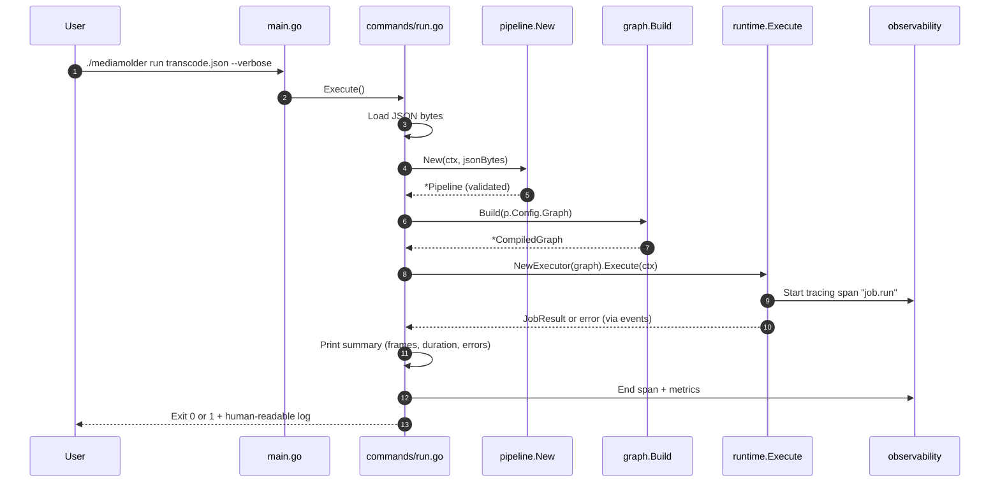
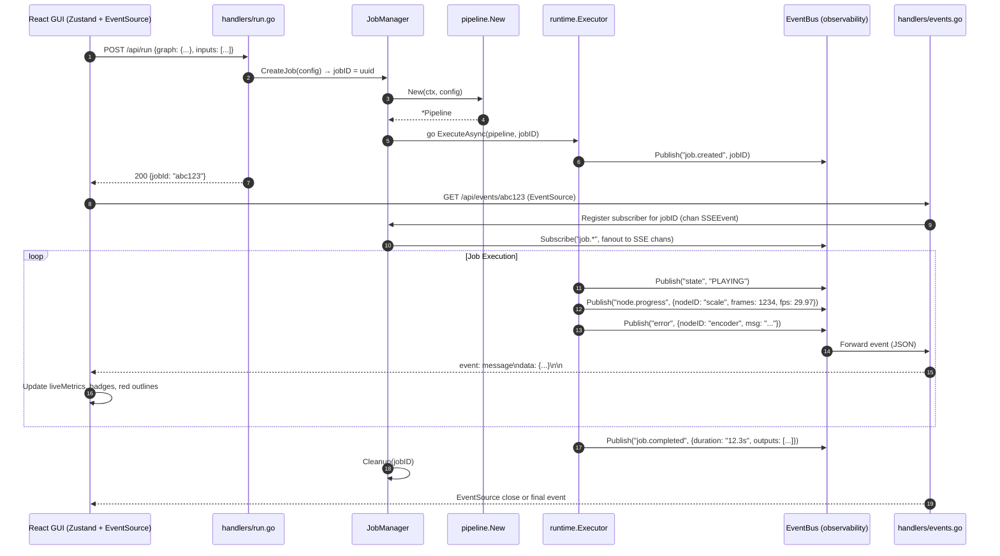
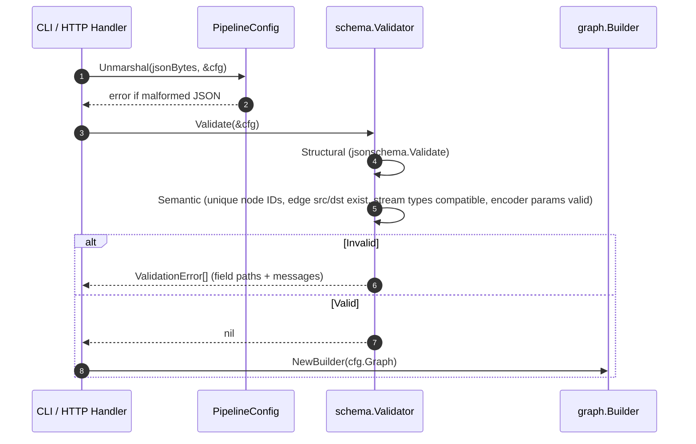
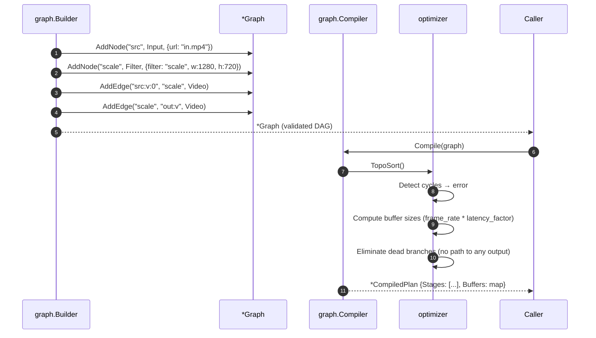
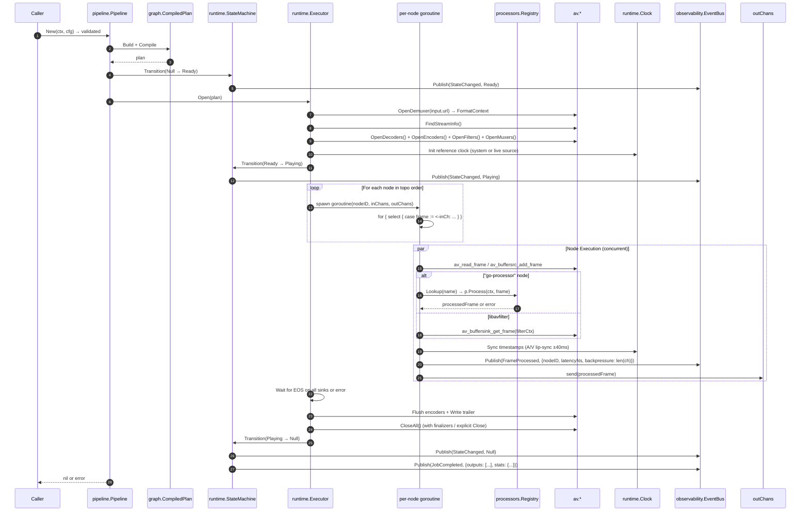
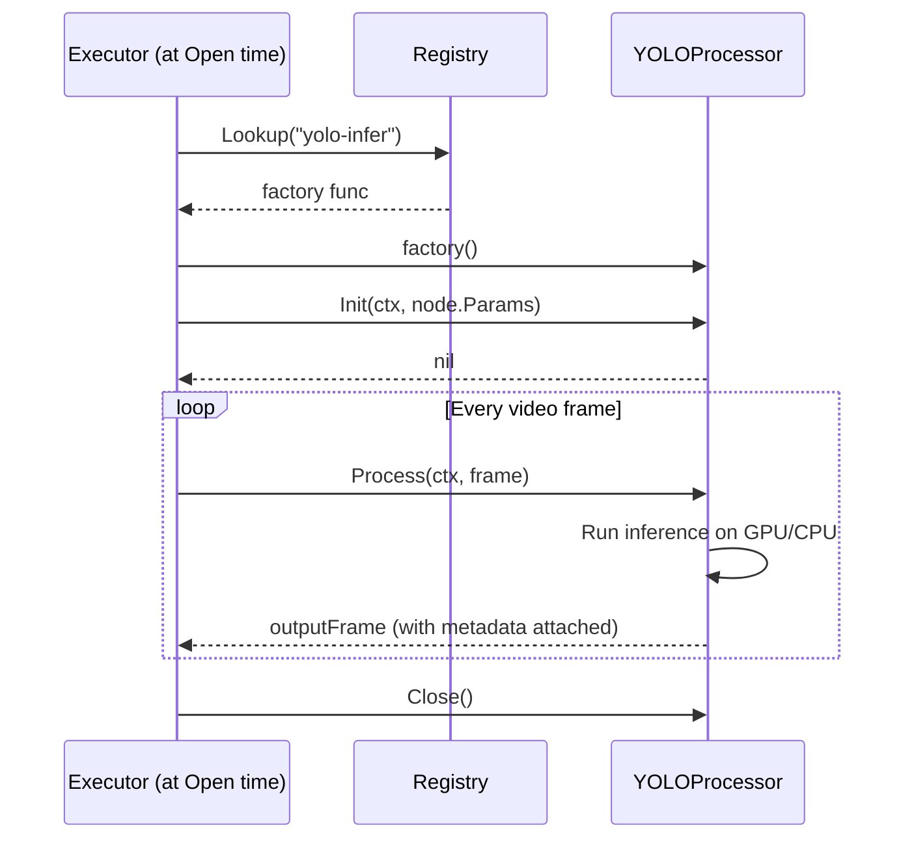
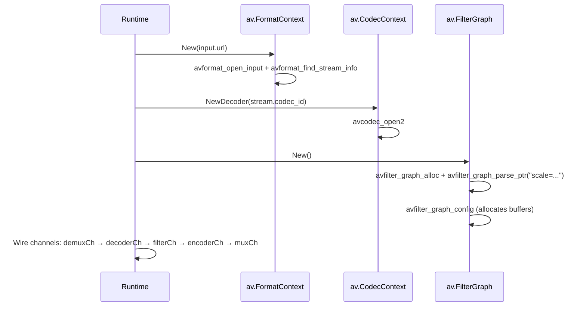
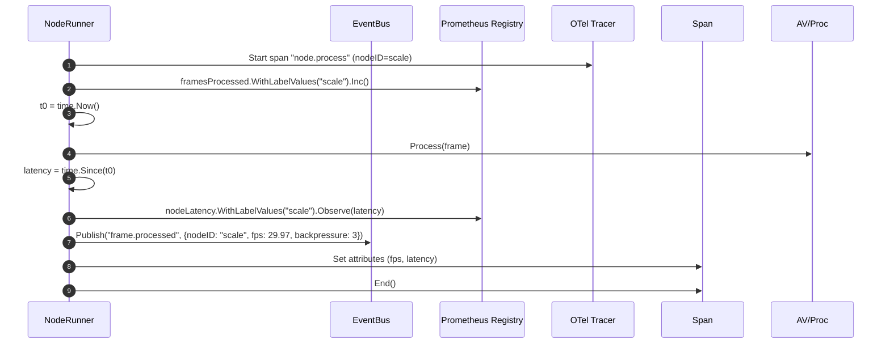
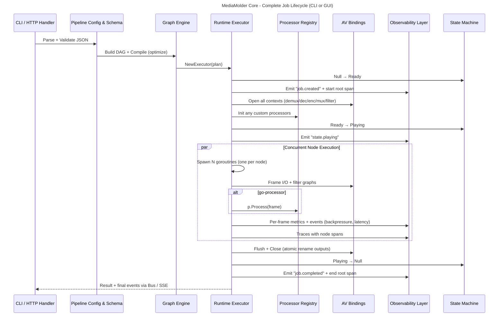

# MediaMolder Core (Go) — Detailed Level 3 Component Documentation

## Purpose of This Document

This document expands **Level 3 (Components)** of the C4 model specifically for the **MediaMolder Core (Go)** container. It provides:

- Fine-grained subcomponent breakdown for each major component.
- Key data structures, interfaces, and concurrency patterns.
- **Mermaid sequence diagrams** and flow diagrams showing the logic for:
  - Parsing a job (JSON → validated config)
  - Building & compiling the graph (DAG construction + optimization)
  - Running the graph (state machine, goroutines, channels, AV bindings, processors)
  - Emitting logs, metrics, traces, and events (observability throughout)
- Cross-cutting concerns: error handling, resource lifecycle, backpressure, dynamic reconfiguration.

This level of detail is intended for **core contributors**, **library embedders**, and anyone implementing custom processors or extending the runtime.

All diagrams use **Mermaid** (renderable on GitHub, Obsidian, Mermaid.live, etc.). For professional UML tools, these can be imported into PlantUML, draw.io, or Structurizr.

---

## 1. CLI Layer (`cmd/mediamolder/`)

### Subcomponents & File Structure (Inferred from standard Go CLI + project patterns)
```
cmd/mediamolder/
├── main.go                 # Root command, version, global flags
├── commands/
│   ├── root.go             # Cobra root (or flag-based)
│   ├── run.go              # `mediamolder run <job.json>` 
│   ├── gui.go              # `mediamolder gui [--port 8080]`
│   ├── convert.go          # `mediamolder convert-cmd "ffmpeg ..."`
│   ├── inspect.go          # `mediamolder inspect <job.json>`
│   ├── list.go             # list-codecs, list-filters, list-processors, list-formats
│   └── ...
└── internal/               # Shared CLI helpers (config loader, printer)
```

### Key Types
```go
type RunCmd struct {
    JobFile string
    JSON    bool   // --json output
    // ...
}

type GlobalFlags struct {
    Verbose bool
    LogLevel string
}
```

### Responsibilities
- Parse subcommands and flags (Cobra or std `flag`).
- Load JSON or invoke converters.
- Dispatch to `pipeline.New(...)` or start HTTP server for GUI.
- Pretty-print results, errors, and progress (human vs machine readable).
- Handle signals (SIGINT → graceful shutdown via context cancellation).

### Sequence Diagram: `mediamolder run transcode.json`



**Notes:**  
- `run` command is the primary path for headless/library usage.  
- Errors are wrapped with `github.com/pkg/errors` or `fmt.Errorf` + `%w` for stack context.  
- Verbose mode enables debug logs from observability layer.

---

## 2. HTTP/GUI Server (`internal/gui/`)

### Subcomponents
```
internal/gui/
├── server.go           # HTTP server setup, embed, graceful shutdown
├── handlers/
│   ├── nodes.go        # GET /api/nodes (palette data)
│   ├── run.go          # POST /api/run → start job, return jobID
│   ├── events.go       # GET /api/events/{jobID} (SSE)
│   ├── probe.go        # POST /api/probe (ffprobe-like metadata)
│   ├── convert.go      # POST /api/convert-cmd
│   ├── encoders.go     # GET /api/encoders/{name}/options
│   └── ...
├── embed.go            # //go:embed frontend/dist/*
├── jobmanager.go       # In-memory job registry + SSE broadcaster
└── middleware.go       # Logging, CORS (dev), rate limiting
```

### Key Types & Patterns
```go
type Server struct {
    http.Server
    jobManager *JobManager
    eventBus   *observability.EventBus
}

type JobManager struct {
    mu    sync.RWMutex
    jobs  map[string]*JobState
    // SSE fan-out per job
}

type SSEEvent struct {
    Event string      `json:"event"`
    Data  interface{} `json:"data"`
}
```

### Responsibilities
- Serve embedded React SPA + static assets.
- Expose REST + SSE API consumed by GUI (and potentially external tools).
- Orchestrate job lifecycle (create → run → stream events → cleanup).
- Support `--dev` mode (no embed, proxy to Vite dev server).
- Multi-job concurrency with per-job resource limits (from threading-architecture.md).

### Sequence Diagram: POST /api/run + SSE Live Updates (GUI Run Flow)



**Key API Contracts (for GUI & embedders):**
- `POST /api/run` → returns `{jobId, status}`
- `GET /api/events/{jobId}` → SSE with events: `state`, `node.progress`, `error`, `log`, `completed`
- All heavy work happens in background goroutines; HTTP handlers are non-blocking.

---

## 3. Pipeline Config & Schema (`pipeline/`, `schema/`)

### Subcomponents
```
pipeline/
├── config.go           # PipelineConfig struct, Inputs, Outputs, Graph
├── pipeline.go         # New(), Validate(), String()
├── state.go            # State constants + transitions
schema/
├── schema.go           # JSON Schema (v1.0, v1.2+ with ui.positions)
├── validator.go        # Validate against schema + semantic checks (edge types match, etc.)
└── migration.go        # Upgrade old JSON versions
```

### Key Types
```go
type PipelineConfig struct {
    SchemaVersion string          `json:"schema_version"`
    Inputs        []InputSpec     `json:"inputs"`
    Graph         GraphSpec       `json:"graph"`
    Outputs       []OutputSpec    `json:"outputs"`
    UI            *UIConfig       `json:"ui,omitempty"`  // positions for GUI
}

type GraphSpec struct {
    Nodes []NodeSpec `json:"nodes"`
    Edges []EdgeSpec `json:"edges"`
}

type NodeSpec struct {
    ID     string                 `json:"id"`
    Type   string                 `json:"type"`   // "filter", "encoder", "go-processor", ...
    Params map[string]interface{} `json:"params"`
}
```

### Responsibilities
- Declarative JSON → strongly-typed Go struct.
- Schema validation (structural + semantic: stream type compatibility, required params, unique IDs).
- Support for multiple versions + migration.
- Default values, parameter coercion (e.g., "1280" → int).

### Sequence Diagram: Job Parsing & Validation



**Error Example:** `"graph.edges[2].to: node 'scale' not found"` or `"inputs[0].streams[0].type: must be video|audio|subtitle"`.

---

## 4. Graph Engine (`graph/`)

### Subcomponents
```
graph/
├── builder.go          # Build(nodes, edges) → *Graph
├── node.go             # Node struct, NodeType enum, StreamType
├── edge.go             # Edge struct, typed connections
├── compiler.go         # Compile(graph) → *CompiledPlan (optimizations)
├── optimizer.go        # buffer sizing, dead-code elimination, topology sort
├── ui.go               # Position persistence (for GUI)
└── dot.go              # Optional: export to Graphviz DOT for debugging
```

### Key Types
```go
type Graph struct {
    Nodes map[string]*Node
    Edges []*Edge
    // adjacency lists for fast traversal
}

type CompiledPlan struct {
    Stages []Stage          // topological execution order
    Buffers map[string]int  // recommended channel buffer sizes
    // ...
}

type Node struct {
    ID       string
    Type     NodeType
    Params   map[string]any
    Inputs   []StreamType   // expected inbound
    Outputs  []StreamType   // produced outbound
}
```

### Responsibilities
- Construct DAG from declarative nodes + edges.
- Validate connectivity (no cycles, type-safe edges: video→video, audio→audio).
- **Compilation passes**: 
  1. Topological sort.
  2. Dead-branch elimination (unused outputs).
  3. Adaptive buffer sizing (based on filter latency hints + frame rate).
  4. Insert implicit split/overlay nodes where needed.
- Store GUI positions (`graph.ui.positions`) so layout survives reload.

### Sequence Diagram: Build → Compile



**Optimization Example:** If a branch leads only to a disabled output, it is pruned before `Open()`.

---

## 5. Runtime Executor & State Machine (`runtime/`, `pipeline/`)

This is the **heart** of MediaMolder.

### Subcomponents
```
runtime/
├── executor.go         # Executor struct, Execute(), spawn goroutines
├── state_machine.go    # State enum, Transition(), guards
├── scheduler.go        # Per-node goroutine + channel wiring
├── clock.go            # Reference clock, A/V sync, seek
├── backpressure.go     # Channel fill monitoring → metrics
└── resource.go         # Threading limits, cgroup/rlimit integration (future)

pipeline/
├── pipeline.go         # Pipeline facade (New, Compile, Open, Start, Close)
├── node_runner.go      # Per-node execution loop
└── finalize.go         # Flush, trailer, atomic rename
```

### Key Types & State Machine
```go
type State int
const (
    StateNull State = iota
    StateReady
    StatePlaying
    StatePaused
    StateError
)

type Executor struct {
    plan     *graph.CompiledPlan
    state    atomic.Int32
    nodes    map[string]NodeRunner
    eventBus *observability.EventBus
    ctx      context.Context
    cancel   context.CancelFunc
    wg       sync.WaitGroup
}
```

### Core Execution Model
- **One goroutine per node** (or per stage in optimized plan).
- **Typed channels** (`chan *av.Frame` or `chan *av.Packet`) between nodes.
- **Backpressure**: If downstream channel is full, upstream blocks (or drops with metric).
- **State transitions** are atomic and emit events.
- **Graceful shutdown**: Context cancellation → drain channels → flush encoders → close.

### Master Sequence Diagram: Full Job Lifecycle (Parse → Run → Finalize)



**Critical Details:**
- **Channel typing**: Video frames use `AV_PIX_FMT_*`, audio uses sample format/rate.
- **Error propagation**: Any node error → cancel context → all goroutines exit → state → Error.
- **Dynamic reconfiguration** (advanced): While PLAYING, some params (drawtext text, scale size) can be updated via event bus without full restart (see `docs/dynamic-reconfiguration.md`).
- **Multi-tenant safety**: Global + per-job thread limits prevent fork-bomb style resource exhaustion.

---

## 6. Processor Registry (`processors/`)

### Subcomponents
```
processors/
├── registry.go         # global map[string]Factory + Register + Lookup
├── interface.go        # Processor interface definition
├── builtin/
│   ├── decoder.go
│   ├── encoder.go
│   ├── filter.go       # wraps libavfilter
│   ├── split.go
│   ├── overlay.go
│   └── ...
└── examples/           # yolov8.go, scene_detector.go, metadata_writer.go (docs)
```

### Core Interface (from `docs/go-processor-nodes.md`)
```go
type Processor interface {
    Name() string
    // Init is called once when the node is opened
    Init(ctx context.Context, params map[string]any) error
    // Process is called for every frame/packet on the node's input edge(s)
    Process(ctx context.Context, in *av.Frame) (*av.Frame, error)
    // Close releases resources (model, GPU context, etc.)
    Close() error
    // Optional: SupportsDynamicParams() bool, UpdateParams(...)
}
```

### How Custom Processors Integrate (Registration at `init()`)

```go
// In user's package (imported by main or plugin)
func init() {
    processors.Register("yolo-infer", func() processors.Processor {
        return &YOLOProcessor{
            model: onnxruntime.LoadModel("yolov8n.onnx"),
            conf:  0.5,
        }
    })
}
```

**Sequence (at runtime):**


**Built-in vs Custom:** Built-ins are registered at package init in `builtin/`. Custom ones are registered by user code before `pipeline.New`.

---

## 7. AV Bindings (`av/`)

### Subcomponents
```
av/
├── context.go          # FormatContext, CodecContext, FilterGraph wrappers
├── frame.go            # Frame struct + pool + conversion helpers
├── packet.go
├── filter.go           # BufferSrc / BufferSink + graph management
├── hwaccel.go          # CUDA, VAAPI, QSV device contexts
├── stream.go
├── error.go            # av_err2str + Go error wrapping
└── cgo/                # .c / .h files with #include <libav*>
```

### Design Principles
- **Idiomatic Go**: `io.Closer`, `context.Context` cancellation, `sync.Pool` for frames.
- **Zero-copy where possible**: `unsafe.Pointer` to libav buffers, but with finalizers / explicit `Close()` to prevent leaks.
- **Resource safety**: Every `Open*` has matching `Close*`; leak detector build tag (`-tags=avleakcheck`).
- **Hardware**: `AVHWDeviceContext` + `AVHWFramesContext` for zero-copy decode → filter → encode on GPU.

### Example: Opening a Decoder + Filter (simplified)

```go
ctx, _ := av.NewFormatContext(inputURL)
ctx.FindStreamInfo()
vstream := ctx.Streams[0]
dec := av.NewCodecContext(vstream.CodecID)
dec.Open()
filterGraph := av.NewFilterGraph()
src := filterGraph.NewBufferSrc("video", dec)
sink := filterGraph.NewBufferSink()
filterGraph.Parse("scale=1280:720,format=yuv420p")
filterGraph.Config()
```

**Sequence (inside Runtime.Open):**


**Frame Lifecycle:** `av_frame_alloc` → fill → `av_buffersrc_add_frame` → downstream `av_buffersink_get_frame` → `av_frame_free` or pool return.

---

## 8. Observability Layer (`observability/`)

### Subcomponents
```
observability/
├── metrics.go          # Prometheus collectors (CounterVec, GaugeVec, Histogram)
├── tracing.go          # OpenTelemetry Tracer + spans
├── eventbus.go         # Typed pub/sub (StateChanged, FrameProcessed, Error, Log)
├── logger.go           # Structured logging (slog or zap) + log levels per node
└── backpressure.go     # Channel monitor goroutine → Gauge metrics
```

### Key Emitters During Execution

| Event Type          | When Emitted                          | Consumers                  | Example Payload |
|---------------------|---------------------------------------|----------------------------|-----------------|
| `StateChanged`      | Every state transition                | SSE, logs, traces          | `{from: "READY", to: "PLAYING", jobId}` |
| `FrameProcessed`    | After every successful node.Process   | Prometheus, Grafana        | `{nodeId, frames, fps, latencyNs, backpressure}` |
| `Error`             | Any node error or AV error            | SSE (red outline), alerts  | `{nodeId, code, message, stack?}` |
| `Log`               | Debug/info/warn from nodes or AV      | GUI log panel, files       | `{level, nodeId, msg, fields}` |
| `JobCompleted`      | Finalize done                         | Metrics + traces           | `{duration, outputs, totalFrames}` |

### Sequence: Metric + Trace + Event Emission (inside a node goroutine)



**Prometheus Example Metrics Exposed:**
- `mediamolder_node_frames_total{node_id="scale",job_id="abc"}`
- `mediamolder_channel_backpressure{edge="scale→encoder"}`
- `mediamolder_job_duration_seconds{status="success"}`

**Integration:** The `mediamolder gui` binary starts a Prometheus HTTP handler on a separate port (configurable) or exposes `/metrics` on the main server.

---

## Cross-Cutting Concerns & Master Flow

### Concurrency & Resource Model
- **Goroutine budget**: Configurable at node, pipeline, and global levels (prevents one job from starving others).
- **Channel buffers**: Adaptive (larger for high-frame-rate or high-latency filters like denoise).
- **Cancellation**: `context.WithCancel` propagated from top-level `Execute` → all node goroutines.
- **Panic recovery**: Every node goroutine has `defer recover()` that publishes `Error` event and shuts down cleanly.

### Error Handling Strategy
1. AV errors → `av.Error` (with `AVERROR` code + `av_err2str`).
2. Wrapped with context: `fmt.Errorf("node %s: %w", nodeID, err)`.
3. Published to EventBus → GUI shows red outline + log entry.
4. State → `Error`; job cannot be resumed (must restart).

### Master End-to-End Diagram (All Core Components)



---

## How to Extend / Contribute

1. **Add a new built-in node**: Implement `Processor` interface + register in `builtin/`.
2. **New optimization pass**: Add to `graph/compiler.go` or `optimizer.go`.
3. **New metric**: Add collector in `observability/metrics.go` and publish from relevant goroutine.
4. **Custom state transition guard**: Modify `state_machine.go`.
5. **Test the diagrams**: Paste into https://mermaid.live — they should render cleanly.

---

## References to Source & Further Docs

- `docs/graph-compilation.md` — Deep dive on optimizer passes.
- `docs/pipeline-state-machine.md` — Full state transition table + guards.
- `docs/threading-architecture.md` — Resource limits & multi-tenancy.
- `docs/observability.md` — All exported metrics & trace attributes.
- `docs/go-processor-nodes.md` — Exact `Processor` interface + examples.
- `av/` package godoc (when built with `go doc`).

---

*This expanded Level 3 documentation complements the parent C4 document. It should be kept in sync with code changes in `graph/`, `runtime/`, `av/`, `processors/`, and `observability/`. For visual UML, export Mermaid to PNG/SVG or import into Enterprise Architect / Visual Paradigm.*

**End of Detailed Level 3 Document**
