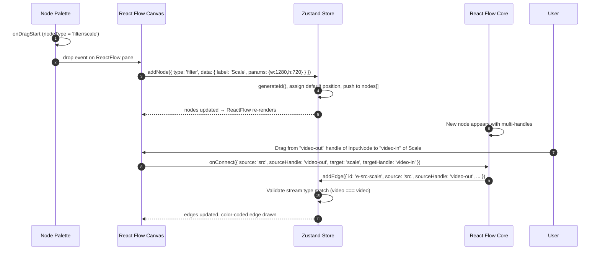
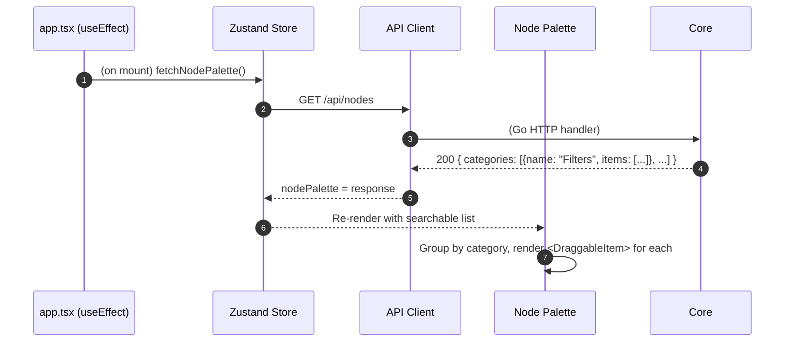
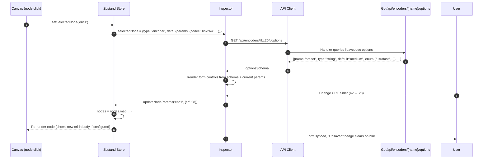
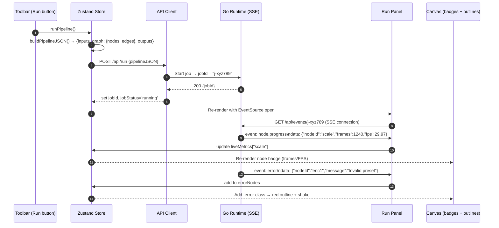
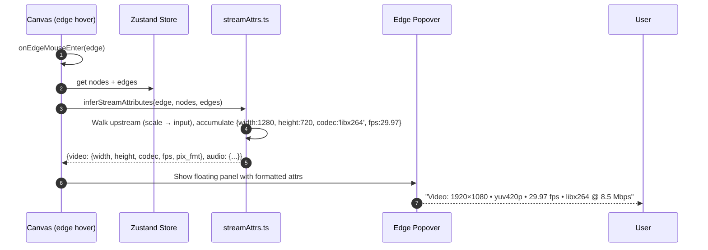
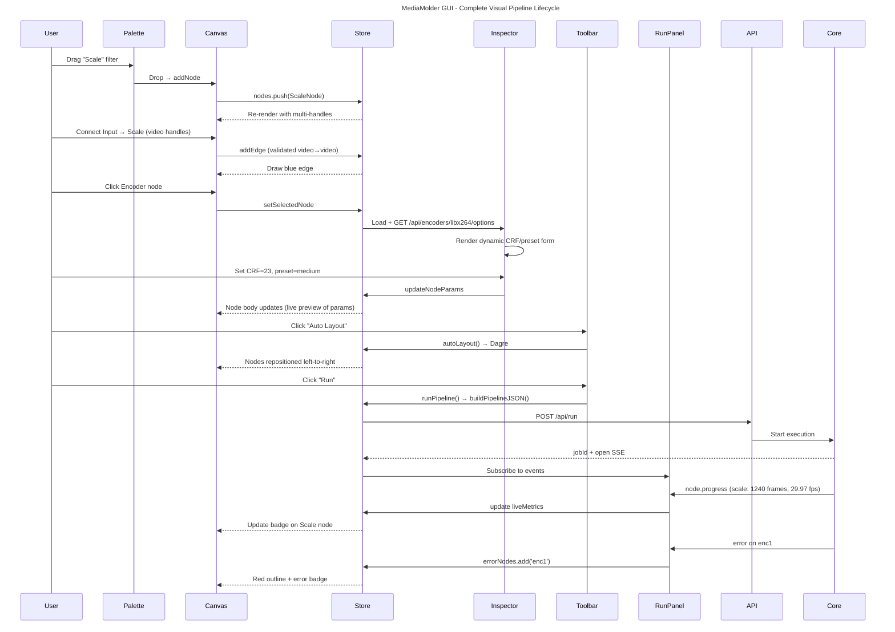

# MediaMolder GUI (React SPA) — Detailed Level 3 Component Documentation

**Version:** 1.1 (Expanded Level 3 – GUI)  
**Date:** April 29, 2026  
**Branch:** feature/front-end  
**Parent Document:** `MediaMolder-C4-Architecture-Documentation.md`

---

## Purpose of This Document

This document expands **Level 3 (Components)** of the C4 model specifically for the **Embedded GUI (React SPA)** container. It provides:

- Fine-grained subcomponent/file structure and React patterns.
- Key TypeScript types, Zustand store shape, React Flow customizations.
- **Mermaid sequence diagrams** and flow diagrams showing the logic for:
  - App initialization & palette population (`/api/nodes`)
  - Drag-and-drop node creation (multi-handle typed streams)
  - Dynamic Inspector with live encoder options (`/api/encoders/{name}/options`)
  - Stream attribute inference (`lib/streamAttrs.ts`) on edge hover
  - Auto-layout with Dagre
  - Run pipeline flow (build JSON → POST /api/run → SSE live metrics → per-node badges & error outlines)
  - Full end-to-end GUI ↔ Core interaction
- Cross-cutting concerns: state reactivity, type-safe stream handling, error states, keyboard shortcuts.

This complements the Core detailed document and is intended for **frontend contributors**, **GUI embedders**, and anyone customizing the visual editor.

All diagrams use **Mermaid** (sequenceDiagram, flowchart, classDiagram). Render at https://mermaid.live or GitHub.

---

## GUI Architecture Overview (React 19 + Vite + TypeScript)

```
frontend/
├── src/
│   ├── main.tsx                    # ReactDOM.createRoot + StrictMode
│   ├── app.tsx                     # Root layout (Toolbar | Palette | Canvas | Inspector | RunPanel)
│   ├── components/
│   │   ├── Canvas.tsx              # ReactFlow wrapper + custom nodes/handles/edges
│   │   ├── Palette.tsx             # Searchable categorized node list (draggable)
│   │   ├── Inspector.tsx           # Dynamic form (encoder options, timing, raw params)
│   │   ├── Toolbar.tsx             # Examples, Import/Export, Convert-cmd, AutoLayout, Run/Stop
│   │   ├── RunPanel.tsx            # Live job status, per-node metrics (frames/FPS), SSE log
│   │   ├── FileBrowserModal.tsx    # Local path selector for inputs/outputs
│   │   └── nodes/                  # Custom React Flow node components
│   │       ├── InputNode.tsx
│   │       ├── FilterNode.tsx
│   │       ├── EncoderNode.tsx
│   │       ├── ProcessorNode.tsx
│   │       └── OutputNode.tsx
│   ├── lib/
│   │   ├── store.ts                # Zustand store (nodes, edges, selected, job, metrics)
│   │   ├── api.ts                  # Typed fetch + EventSource wrappers
│   │   ├── streamAttrs.ts          # Graph-walking inference (resolution, codec, fps, etc.)
│   │   ├── types.ts                # Shared TS interfaces (MediaNode, StreamType, etc.)
│   │   └── utils.ts                # colorForStreamType, buildPipelineJSON, etc.
│   ├── styles/
│   │   └── globals.css             # Handle colors, node themes, edge styles
│   └── vite.config.ts              # Proxy /api → localhost:8080 (dev)
└── package.json                    # react@19, @xyflow/react@12, zustand@5, @dagrejs/dagre
```

**Technology Choices (why they fit):**
- **React Flow v12** (`@xyflow/react`): Industry standard for node-based UIs; excellent multi-handle, custom node, and edge support.
- **Zustand**: Minimalist, hook-based state (no boilerplate like Redux). Perfect for canvas + inspector sync.
- **Dagre**: Fast, deterministic auto-layout for DAGs (left-to-right media pipelines).
- **SSE (EventSource)**: Native browser support for live job metrics without WebSocket complexity.

---

## 1. Zustand Store (`lib/store.ts`)

### Subcomponents / Store Shape
```ts
// lib/store.ts
interface PipelineState {
  // Graph data (React Flow compatible + MediaMolder extensions)
  nodes: MediaNode[];
  edges: Edge[];

  // Selection & UI
  selectedNodeId: string | null;
  selectedEdgeId: string | null;
  showFileBrowser: boolean;
  fileBrowserMode: 'input' | 'output' | null;

  // Job / Run state
  jobId: string | null;
  jobStatus: 'idle' | 'running' | 'completed' | 'error';
  liveMetrics: Record<string, { frames: number; fps: number; latencyMs?: number }>;
  errorNodes: Set<string>;           // node IDs with red outline

  // Examples & palette data (cached)
  examples: ExampleJob[];
  nodePalette: NodePaletteItem[];   // from /api/nodes

  // Actions (all mutations go through these)
  addNode: (node: Omit<MediaNode, 'id' | 'position'>) => void;
  updateNodeParams: (id: string, params: Record<string, any>) => void;
  deleteNode: (id: string) => void;
  addEdge: (edge: Edge) => void;
  deleteEdge: (id: string) => void;
  setSelectedNode: (id: string | null) => void;
  autoLayout: () => void;           // calls Dagre
  runPipeline: () => Promise<void>;
  stopPipeline: () => void;
  // ... more (importJSON, exportJSON, loadExample, etc.)
}

export const usePipelineStore = create<PipelineState>((set, get) => ({
  nodes: [],
  edges: [],
  // ... initial state + actions
}));
```

### Key Design Decisions
- **Single source of truth**: Both React Flow `<ReactFlow nodes={nodes} edges={edges} />` and Inspector read/write the same Zustand slice.
- **Immutability**: All updates use `produce` (immer) or spread for reactivity.
- **Derived data**: `get().buildPipelineJSON()` converts Zustand nodes/edges → MediaMolder `PipelineConfig` JSON for `/api/run`.
- **Persistence**: Optional `persist` middleware saves last graph to localStorage (for dev reloads).

### Sequence Diagram: Node Selection → Inspector Update (Reactive Sync)

```mermaid
sequenceDiagram
    autonumber
    participant Canvas as React Flow Canvas
    participant Store as Zustand Store
    participant Inspector as Dynamic Inspector
    participant API as API Client

    Canvas->>Canvas: User clicks node (onNodeClick)
    Canvas->>Store: setSelectedNode(node.id)
    Store-->>Canvas: Re-render with selected class
    Store-->>Inspector: selectedNodeId changed → useEffect
    Inspector->>Store: get().nodes.find(n => n.id === selectedNodeId)
    alt Encoder node
        Inspector->>API: GET /api/encoders/${codec}/options
        API-->>Inspector: AVOption[] (presets, crf, bitrate, etc.)
        Inspector->>Inspector: Render dynamic <input> / <select> controls
    else Other node type
        Inspector->>Inspector: Render static form fields from node.data.params
    end
    Inspector-->>User: Form ready for editing
```



**Reactivity Note:** Zustand + React 19 compiler ensures minimal re-renders. Only components subscribed to `selectedNodeId` or specific `nodes[id]` update.

---

## 2. React Flow Canvas (`components/Canvas.tsx` + `nodes/*.tsx`)

### Custom Node & Handle Design (Multi-Handle Typed Streams)

Each node type renders **multiple handles** based on supported stream types:

```tsx
// nodes/EncoderNode.tsx (example)
function EncoderNode({ data, id, selected }: NodeProps<MediaNodeData>) {
  const streamTypes = ['video', 'audio']; // dynamic from node type

  return (
    <div className={`media-node encoder ${selected ? 'selected' : ''} ${data.error ? 'error' : ''}`}>
      <div className="node-header">{data.label}</div>
      
      {/* Video handles */}
      <Handle type="target" position={Position.Left} id="video-in" 
              className="handle-video" data-stream="video" />
      <Handle type="source" position={Position.Right} id="video-out" 
              className="handle-video" data-stream="video" />

      {/* Audio handles */}
      <Handle type="target" position={Position.Left} id="audio-in" 
              className="handle-audio" data-stream="audio" />
      <Handle type="source" position={Position.Right} id="audio-out" 
              className="handle-audio" data-stream="audio" />

      <div className="node-body">
        {data.params.preset && <span>Preset: {data.params.preset}</span>}
        {/* live badge from liveMetrics */}
      </div>
    </div>
  );
}
```

**CSS (globals.css):**
```css
.handle-video { background: #3b82f6; border-color: #1e40af; }
.handle-audio { background: #10b981; border-color: #047857; }
.handle-subtitle { background: #8b5cf6; }
.edge-video { stroke: #3b82f6; stroke-width: 2; }
.edge-audio { stroke: #10b981; stroke-width: 2; }
```

### Dagre Auto-Layout Integration

```ts
// lib/store.ts action
autoLayout: () => {
  const { nodes, edges } = get();
  const dagreGraph = new dagre.graphlib.Graph();
  dagreGraph.setDefaultEdgeLabel(() => ({}));
  dagreGraph.setGraph({ rankdir: 'LR', nodesep: 80, ranksep: 120 });

  nodes.forEach(n => dagreGraph.setNode(n.id, { width: 180, height: 80 }));
  edges.forEach(e => dagreGraph.setEdge(e.source, e.target));

  dagre.layout(dagreGraph);

  const newNodes = nodes.map(n => {
    const pos = dagreGraph.node(n.id);
    return { ...n, position: { x: pos.x, y: pos.y } };
  });
  set({ nodes: newNodes });
}
```

### Sequence Diagram: Drag from Palette → Canvas Node Creation + Edge Connection



**Validation on Connect:** Custom `isValidConnection` prop rejects mismatched stream types (video → audio) with toast + shake animation.

---

## 3. Node Palette (`components/Palette.tsx`)

### Subcomponents & Data Flow
- Fetches once on mount: `GET /api/nodes` → returns categorized list (Filters by intent, Encoders, Processors, Sources, Sinks).
- Search input filters the list client-side (fuse.js or simple includes).
- Each item is `draggable` with `dataTransfer.setData('nodeType', ...)` + JSON params template.
- Categories collapsible (Scaling, Color, Denoise, Audio, etc.).

### Sequence Diagram: Initial Load → Palette Populated



**Performance:** Palette data is cached in Zustand; only re-fetched on explicit "Refresh palette" button (rare).

---

## 4. Dynamic Inspector (`components/Inspector.tsx`)

### Live Encoder Options Loading

When an **Encoder** node is selected:
1. Inspector reads `node.data.params.codec` (e.g., "libx264")
2. Calls `GET /api/encoders/libx264/options`
3. Backend returns `AVOption[]` with `name`, `type`, `default`, `min/max`, `enum` values, `help`.
4. Dynamically renders:
   - `<select>` for presets/enums
   - `<input type="range">` + number for numeric (crf, bitrate)
   - `<textarea>` for raw `x264-params`
   - Grouped "Advanced" section with search

### Sequence Diagram: Select Encoder Node → Dynamic Form + Live Update



**Type Safety:** All form values are validated against the schema before `updateNodeParams`.

---

## 5. Toolbar + Run Panel (`components/Toolbar.tsx` + `RunPanel.tsx`)

### Toolbar Actions
- **Examples** dropdown → load from `/api/examples` or local `testdata/`
- **Import JSON** / **Export JSON** → file dialog + `buildPipelineJSON()`
- **Import FFmpeg command** → `POST /api/convert-cmd` → populates graph
- **Auto Layout** → Dagre (button or `?` key)
- **Run / Stop** → calls `store.runPipeline()` / `stopPipeline()`

### Run Panel (Live Metrics via SSE)

```tsx
// RunPanel.tsx
function RunPanel() {
  const { jobId, jobStatus, liveMetrics, errorNodes } = usePipelineStore();

  useEffect(() => {
    if (!jobId) return;
    const es = new EventSource(`/api/events/${jobId}`);
    es.onmessage = (e) => {
      const evt = JSON.parse(e.data);
      if (evt.event === 'node.progress') {
        usePipelineStore.setState(s => ({
          liveMetrics: { ...s.liveMetrics, [evt.data.nodeId]: evt.data }
        }));
      }
      if (evt.event === 'error') {
        usePipelineStore.setState(s => ({ errorNodes: new Set([...s.errorNodes, evt.data.nodeId]) }));
      }
    };
    return () => es.close();
  }, [jobId]);

  return (
    <div className="run-panel">
      <div>Status: {jobStatus}</div>
      {Object.entries(liveMetrics).map(([nodeId, m]) => (
        <div key={nodeId} className={errorNodes.has(nodeId) ? 'error' : ''}>
          {nodeId}: {m.frames} frames @ {m.fps} fps
        </div>
      ))}
    </div>
  );
}
```

### Sequence Diagram: Click Run → SSE Live Updates → Error Outline



**Stop Button:** Sends `DELETE /api/jobs/{jobId}` or context cancellation signal.

---

## 6. API Client (`lib/api.ts`)

### Typed Wrappers
```ts
// lib/api.ts
export const api = {
  getNodes: () => fetch('/api/nodes').then(r => r.json()),
  runPipeline: (config: PipelineConfig) => 
    fetch('/api/run', { method: 'POST', body: JSON.stringify(config) }).then(r => r.json()),
  getEncoderOptions: (codec: string) => fetch(`/api/encoders/${codec}/options`).then(r => r.json()),
  probeFile: (path: string) => fetch('/api/probe', { method: 'POST', body: JSON.stringify({path}) }),
  // SSE helper
  createEventSource: (jobId: string) => new EventSource(`/api/events/${jobId}`),
};
```

**Error Handling:** Centralized `try/catch` + toast notifications (react-hot-toast) for 4xx/5xx.

---

## 7. Stream Attribute Inference (`lib/streamAttrs.ts`)

### Graph-Walking Logic (Backward Propagation)

When user hovers/clicks an edge, the system infers properties by walking **upstream** from the edge's source node, applying transformations:

```ts
// lib/streamAttrs.ts
export function inferStreamAttributes(
  edge: Edge, 
  nodes: MediaNode[], 
  edges: Edge[]
): StreamAttributes {
  let currentNodeId = edge.source;
  let attrs: StreamAttributes = { video: {}, audio: {} };

  while (currentNodeId) {
    const node = nodes.find(n => n.id === currentNodeId);
    if (!node) break;

    switch (node.type) {
      case 'filter':
        if (node.data.params.w && node.data.params.h) {
          attrs.video.width = node.data.params.w;
          attrs.video.height = node.data.params.h;
        }
        if (node.data.params.fps) attrs.video.fps = node.data.params.fps;
        break;
      case 'encoder':
        attrs.video.codec = node.data.params.codec;
        attrs.video.bitrate = node.data.params.b;
        break;
      case 'input':
        // base properties from probe or defaults
        attrs = { ...attrs, ...node.data.probedAttrs };
        break;
    }
    // move upstream
    const incoming = edges.find(e => e.target === currentNodeId && e.targetHandle === edge.sourceHandle);
    currentNodeId = incoming?.source;
  }
  return attrs;
}
```

### Sequence Diagram: Edge Hover → Popover with Inferred Attributes



**Caching:** Results are memoized in a `Map<edgeId, attrs>` inside the store for performance on large graphs.

---

## Master End-to-End GUI Flow (All Components)



---

## Cross-Cutting GUI Concerns

- **Keyboard Shortcuts**: `Delete/Backspace` = delete selected, `?` = help modal, `Ctrl/Cmd + L` = auto-layout, `Ctrl/Cmd + Enter` = Run.
- **Undo/Redo**: Optional `zustand/middleware` + `use-undo` or simple history stack in store.
- **Accessibility**: ARIA labels on handles, keyboard-navigable palette, high-contrast error states.
- **Performance**: React Flow `onlyRenderVisibleElements`, memoized custom nodes, virtualized palette list for 100+ filters.
- **Theming**: CSS variables for node colors, dark mode support (matches Go CLI aesthetic).

---

## How to Extend the GUI

1. **New node type**: Add `CustomNode.tsx` + register in React Flow `nodeTypes` map + add to `/api/nodes` response.
2. **New Inspector control**: Extend dynamic form renderer in `Inspector.tsx` based on AVOption `type`.
3. **New inference rule**: Add case in `streamAttrs.ts` (e.g., `drawtext` → injects text metadata).
4. **Custom layout algorithm**: Replace Dagre in `autoLayout` action (e.g., ELK.js for more complex graphs).

---

## References

- Parent C4 doc + Core detailed Level 3 (`MediaMolder-Core-Detailed-Level3.md`)
- `docs/gui.md` (user guide)
- `frontend/src/lib/streamAttrs.ts` (source of inference logic)
- React Flow docs: https://reactflow.dev
- Zustand: https://zustand-demo.pmnd.rs

---

*This expanded GUI Level 3 documentation should live alongside the Core detailed document. Update whenever React Flow, Zustand, or backend API contracts change. Diagrams are designed to be copy-pasted into architecture reviews or onboarding materials.*

**End of MediaMolder GUI Detailed Level 3 Document**
