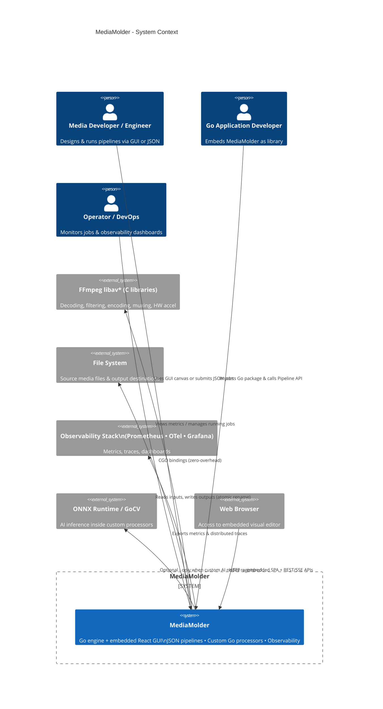
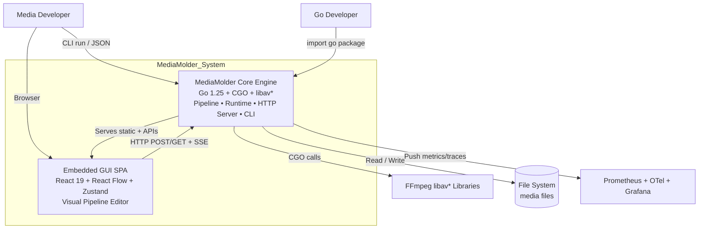

# MediaMolder C4 Architecture Documentation

## Overview

This document applies the **C4 Model** (Context, Containers, Components, Code) — a lightweight, hierarchical approach to software architecture documentation created by Simon Brown. It is ideal for this project because the codebase is well-structured into clear layers (CLI, HTTP, graph, runtime, processors, AV bindings, frontend).

> **See also:** [field-ownership.md](field-ownership.md) — authoritative
> classification of every `Config` / `Output` / `GlobalOptions` / `Input`
> field as node-local, authoring shorthand, muxer-owned, true global, or
> deferred. Drives the normalization boundary work tracked in
> `private_local/normalization_plan_revised.md`.
>
> **Normalization boundary:** `pipeline.NormalizeConfig(cfg) → (*graph.Def, []NormalizeWarning, error)`
> is the single entry point that lowers an authoring `pipeline.Config`
> into the executable `graph.Def` consumed by `graph.Build` →
> `graph.Compile` → `runtime.Scheduler`. `runGraph` calls it in
> `pipeline/engine.go` and surfaces warnings on the existing pipeline
> events channel. The function is currently a thin wrapper around
> `configToGraphDef`; subsequent commits move all `__*` sentinel
> lowering behind it.

---

## Level 1: System Context Diagram

**Goal:** Understand the big picture — who uses MediaMolder and what external systems it interacts with.

### Primary Users / Actors
- **Media Pipeline Developers & Engineers** — Design transcoding, overlay, ABR, AI-enhanced pipelines using the GUI or JSON files. Primary consumers of the visual editor and CLI.
- **Go Application Developers** — Embed `github.com/MediaMolder/MediaMolder` as a library inside larger services (streaming platforms, video CMS, live encoders).
- **DevOps / Platform Operators** — Deploy, monitor multi-tenant jobs, view Grafana dashboards, manage resource limits.
- **AI/ML Engineers** — Implement and register custom Go processors that call ONNX models, computer vision, etc.

### External Systems & Dependencies
- **File System** — Local disk, NFS, or mounted object storage for reading source media and writing outputs (MP4, WebM, HLS segments, etc.). No built-in database.
- **FFmpeg libav* Libraries** (v8.1+ / libav* 62.x) — The “heavy lifting” engine: decoding, filtering, encoding, muxing, hardware acceleration (CUDA, QSV, VAAPI). Accessed exclusively via CGO; **never** spawns the `ffmpeg` binary.
- **Observability Stack** (optional but first-class) — Prometheus (metrics), OpenTelemetry Collector / Jaeger (traces), Grafana (dashboards). Emits FPS, per-node latency, channel backpressure, CPU/GPU usage.
- **AI/ML Runtimes** (for custom processors) — `onnxruntime_go`, GoCV (OpenCV). Users bring their own models.
- **Web Browser** — Any modern browser for the embedded GUI (`http://127.0.0.1:8080` by default).
- **FFmpeg CLI** (migration only) — The `convert-cmd` endpoint parses legacy `ffmpeg -i ... -vf scale=...` strings into native JSON.

### Context Diagram (Mermaid)



**Key Insight:** MediaMolder is both a **standalone CLI/GUI tool** and an **embeddable library**. The GUI is optional and fully embedded — no separate web server or Node.js runtime required in production.

---

## Level 2: Container Diagram

**Goal:** Identify the major building blocks (containers) that make up the system and how they communicate.

### Containers

#### 1. MediaMolder Core Engine
- **Type:** Go 1.25+ binary (or library) with CGO.
- **Built via:** `go build` or `make build-gui` (embeds frontend assets).
- **Responsibilities:**
  - JSON schema validation & pipeline parsing.
  - DAG construction, compilation & optimization.
  - Goroutine-per-node execution model with typed channels and backpressure.
  - Dynamic processor registry (built-in + user Go code).
  - Full libav* lifecycle management (open → process → close).
  - HTTP server (API + static file serving for GUI).
  - CLI command routing.
  - State machine, clock synchronization, observability hooks.
- **Technology Stack:** Go + CGO + libav*, Prometheus client, OpenTelemetry SDK, `errgroup`, channels.
- **Deployment:** Single static or dynamically-linked binary. Can run as daemon, CLI job, or embedded in another Go process.

#### 2. Embedded GUI Web Application (React SPA)
- **Type:** Production build of Vite + React 19 app, served as static assets from the Go binary (`internal/gui` uses `//go:embed`).
- **Built via:** `npm run build` inside `frontend/`, then embedded.
- **Responsibilities:**
  - Node-based visual editor (React Flow canvas).
  - Drag-and-drop palette, inspector forms, live monitoring.
  - Job submission and real-time SSE event streaming.
  - FFmpeg command importer, JSON import/export, auto-layout.
- **Technology Stack:** React 19, TypeScript, Vite 6, `@xyflow/react` (React Flow v12), `@dagrejs/dagre`, Zustand, CSS Modules / Tailwind? (plain CSS in current).
- **Communication:** Same-origin HTTP to Core’s API server (`/api/*`). In dev mode, Vite dev server proxies `/api` → `localhost:8080`.

**No other containers** — there is no separate database, message queue, or cache. Everything is in-process and ephemeral per job (multiple concurrent jobs supported with resource throttling).

### Container Diagram (Mermaid)



**Deployment Variants:**
- **Full GUI binary:** `make build-gui` → `./mediamolder gui`
- **Headless / Library:** `go build -o mediamolder ./cmd/mediamolder` (no frontend assets)
- **Dev frontend:** `cd frontend && npm run dev` (proxies to running Go server on 8080)

---

## Level 3: Component Diagram

**Goal:** Zoom into the two main containers and show the major internal components and their responsibilities.

### 3.1 Components — MediaMolder Core (Go)

| Component              | Package / Location          | Responsibility |
|------------------------|-----------------------------|----------------|
| **CLI Layer**          | `cmd/mediamolder/`          | Subcommand parsing (`run`, `gui`, `convert-cmd`, `inspect`, `list-*`), flag handling, entrypoint dispatch |
| **HTTP / GUI Server**  | `internal/gui/`             | `net/http` or Gin server, static asset serving (`//go:embed frontend/dist`), all `/api/*` handlers, SSE event streaming, job orchestration facade |
| **Pipeline Config**    | `pipeline/`, `schema/`      | `PipelineConfig` struct, JSON unmarshal + validation (schema v1.x), multi-input/output, stream selection, ABR support |
| **Graph Engine**       | `graph/`                    | DAG construction from nodes+edges, compilation passes (buffer sizing, dead-code elimination, topology sort), UI position persistence |
| **Runtime Executor**   | `runtime/`, `pipeline/`     | State machine (NULL→READY→PLAYING→NULL), goroutine groups per node, channel plumbing, backpressure watchdog, graceful shutdown, clock sync (`clock/`) |
| **Processor Registry** | `processors/`               | Global `RegisterProcessor(name, factory)`, built-in nodes (decoder, filter, encoder, split, overlay, …), interface for custom Go processors |
| **AV Bindings**        | `av/`                       | Idiomatic Go wrappers around libav* (`FormatContext`, `CodecContext`, `FilterGraph`, `Frame`, `Packet`), resource safety (`io.Closer`), HW accel contexts |
| **Observability**      | `observability/`            | Prometheus collectors, OTel spans around build/open/execute phases, typed event bus (`StateChanged`, `Error`, `FrameProcessed`) |
| **Compatibility**      | `compat/`, `docs/`          | FFmpeg CLI → JSON parser, migration guide, capability matrix |

**Core Data Flow (simplified):**
```
JSON → PipelineConfig → Graph (DAG) → Compiled Plan → Open Resources (demux/decoders/filters/encoders/muxers) 
→ Execute (goroutines + channels) → Finalize (flush + atomic rename) + Events/Metrics
```

At the encoder boundary, decoded video frame types from the source bitstream are
sanitized before `avcodec_send_frame`. This mirrors FFmpeg's encoder pipeline:
source `pict_type` is descriptive, while explicit controls (`force_key_frames`,
processor force-keyframe metadata, or runtime restart points) request IDR frames.
Windowed processors can implement `FrameLookahead`; the runtime delays frame
delivery so metadata, segment cuts, and IDR requests are aligned to the actual
event frame.

> **📖 Expanded Level 3 Documentation Available**  
> For **detailed subcomponent breakdowns, key Go types/interfaces, and UML-style Mermaid sequence diagrams** (parse job, build graph, full execution lifecycle, observability emission, etc.), see **[MediaMolder-Core-Detailed-Level3.md](MediaMolder-Core-Detailed-Level3.md)**. It covers all 8 core components with 10+ sequence diagrams and code examples.


### 3.2 Components — Embedded GUI (React SPA)

| Component              | Location (frontend/src/)     | Responsibility |
|------------------------|------------------------------|----------------|
| **Root App**           | `main.tsx`, `app.tsx`        | React 19 entry, global providers, layout (Toolbar + Palette + Canvas + Inspector + Run Panel) |
| **State Store**        | `lib/store.ts` (Zustand)     | Single source of truth: nodes, edges, selectedNode, jobStatus, liveMetrics, examples, streamAttrsCache. All mutations flow through actions. |
| **Canvas / Flow Editor**| `components/Canvas.tsx` or Flow wrapper | `<ReactFlow>` with custom node types, multi-handle per stream (video/audio/subtitle), color-coded edges, delete (Backspace), drag-to-connect validation, edge popovers for inferred attributes |
| **Node Palette**       | `components/Palette.tsx`     | Searchable, categorized list (Sources, Filters by intent, Encoders, Processors, Sinks). Drag to canvas creates node. Data from `GET /api/nodes` |
| **Dynamic Inspector**  | `components/Inspector.tsx`   | Form for selected node. Encoder options loaded live from `/api/encoders/{name}/options`. Timing trim controls, raw params textarea, “Get Properties” probe button |
| **Toolbar & Controls** | `components/Toolbar.tsx`     | Examples dropdown, New/Import/Export JSON, Import FFmpeg cmd (POST /api/convert-cmd), Auto Layout (Dagre), Run/Stop, Help (?) |
| **Run / Monitoring Panel** | `components/RunPanel.tsx` | Job submission, EventSource listener on `/api/events/{jobId}`, live per-node badges (frames, FPS), error highlighting, log stream |
| **API Client**         | `lib/api.ts`                 | Typed `fetch` wrappers for all endpoints + SSE helper |
| **Utilities**          | `lib/streamAttrs.ts`         | Graph-walking function that infers resolution, pix_fmt, codec, bitrate, etc. by traversing upstream nodes and applying param effects (e.g. `scale` node) |

**GUI Internal Flow:**
```
User drags node from Palette 
  → Canvas creates React Flow node + Zustand entry 
  → Inspector renders dynamic form 
  → User edits params → Zustand update → Canvas re-renders 
  → Click Run → POST /api/run with current graph JSON 
  → SSE stream updates liveMetrics in Zustand → Badges & outlines update in real time
```

### Component Diagram (Mermaid - Core + GUI)

```mermaid
graph TD
    subgraph Core["MediaMolder Core Container"]
        CLI[CLI Layer]
        HTTP[HTTP Server + API]
        Config[Pipeline Config & Schema]
        Graph[Graph Engine]
        Runtime[Runtime Executor]
        Proc[Processor Registry]
        AV[AV Bindings (CGO)]
        Obs[Observability]
    end

    subgraph GUI["Embedded GUI Container (React SPA)"]
        Store[Zustand Store]
        Canvas[React Flow Canvas]
        Palette[Palette + Drag]
        Inspector[Dynamic Inspector]
        Toolbar[Toolbar + RunPanel]
        API[API Client + SSE]
    end

    CLI --> HTTP
    HTTP --> Config
    Config --> Graph
    Graph --> Runtime
    Runtime --> Proc
    Runtime --> AV
    Runtime --> Obs
    HTTP -->|embed + serve| GUI
    API -->|HTTP + SSE| HTTP

    Palette -->|create node| Canvas
    Canvas <-->|sync| Store
    Inspector <-->|edit params| Store
    Toolbar -->|run / import| API
    Store -->|render| Canvas
    Store -->|render| Inspector
    Store -->|render| Toolbar
```

---

## Level 4: Code Level

**Goal:** Give developers concrete code-level insight into the most important abstractions and file locations. Full source is in the repository.

### Core Go — Most Important Abstractions

**Processor Interface** (see `docs/go-processor-nodes.md` and `processors/`):
```go
type Processor interface {
    Name() string
    Process(ctx context.Context, frame *av.Frame) (*av.Frame, error)
    // Optional methods: Init, Close, SetParams, etc.
}
```

**Registration (user code, `init()`):**
```go
mediamolder.RegisterProcessor("scene-detector", func() processors.Processor {
    return &SceneDetector{threshold: 0.3}
})
```

**Pipeline Lifecycle (high-level):**
```go
p, _ := pipeline.New(ctx, config)   // parse + validate
p.Compile()                         // optimize
p.Open()                            // init all libav contexts
p.Start()                           // or Execute() — spawns goroutines
// ... wait for completion or events ...
p.Close()
```

**Key Packages & Entry Points**
- `cmd/mediamolder/main.go` + `gui.go` — CLI + `gui` subcommand that starts HTTP server + opens browser.
- `internal/gui/server.go` — HTTP routes and embed logic.
- `graph/node.go`, `graph/edge.go`, `graph/compiler.go`
- `pipeline/pipeline.go`, `pipeline/state.go`
- `av/frame.go`, `av/context.go` — the CGO boundary (careful resource management).
- `observability/metrics.go`, `observability/tracing.go`

### Frontend TypeScript — Most Important Abstractions

**Node Data Shape (simplified):**
```ts
interface MediaNode {
  id: string;
  type: 'input' | 'filter' | 'encoder' | 'processor' | 'output';
  position: { x: number; y: number };
  data: {
    label: string;
    params: Record<string, any>;
    // encoder-specific: { preset?: string; crf?: number; ... }
  };
  // React Flow handles are added dynamically based on stream types
}
```

**Zustand Store (core actions):**
```ts
interface PipelineState {
  nodes: MediaNode[];
  edges: Edge[];
  selectedNodeId: string | null;
  jobId: string | null;
  liveMetrics: Record<string, { frames: number; fps: number }>;
  runPipeline: () => Promise<void>;
  // ...
}
```

**Custom React Flow Node Example:**
```tsx
function FilterNode({ data, id }: NodeProps) {
  return (
    <div className="media-node filter">
      <Handle type="target" position={Position.Left} id="video-in" />
      <Handle type="source" position={Position.Right} id="video-out" />
      {/* ... form preview ... */}
    </div>
  );
}
```

**Stream Attribute Inference** (`lib/streamAttrs.ts`):
Walks the graph backward from an edge, accumulating effects of `scale`, `format`, `encoder`, etc., to show “1920×1080 • yuv420p • 29.97 fps • libx264” in edge popovers.

**Build & Embed Flow:**
`frontend/` → `npm run build` → `dist/` → `//go:embed dist/*` in Go → served at runtime. Dev mode uses Vite HMR + proxy.

---

## Summary & Recommendations

**Strengths of Current Architecture (feature/front-end):**
- Clean separation: Core engine is pure Go + CGO; GUI is a thin, modern React layer that talks only over HTTP/SSE.
- Single-binary deployment is a huge win for adoption.
- React Flow + Zustand is an excellent, lightweight choice for a node-based editor.
- Processor model elegantly solves the “custom logic” problem that plagues traditional FFmpeg.
- Observability is baked in from day one.

**Suggested Improvements / Future ADRs:**
1. Add official C4 diagrams rendered with Structurizr or Mermaid C4 plugin to `docs/images/`.
2. Publish OpenAPI spec for the `/api/*` surface (generated from handlers).
3. Consider WebSocket or gRPC for even lower-latency live metrics (SSE is fine for current needs).
4. Extract a reusable `@mediamolder/react` component library so others can embed the editor in their own dashboards.
5. Add E2E tests for the GUI (Playwright) that also exercise the Go backend.

**How to Use This Document:**
- Onboard new contributors: Start here, then dive into `docs/gui.md`, `docs/go-processor-nodes.md`, `docs/graph-compilation.md`.
- Architecture reviews: Reference the container and component diagrams.
- Living docs: Update this file whenever major packages or the frontend structure changes.

**References & Further Reading**
- Main README & Quickstart
- `docs/gui.md` — Detailed GUI user guide & API surface
- `docs/json-config-reference.md` — Full pipeline JSON schema
- `docs/go-processor-nodes.md` — How to write custom processors
- `docs/threading-architecture.md` & `docs/observability.md`
- C4 Model official site: https://c4model.com/

---

**End of Document**
