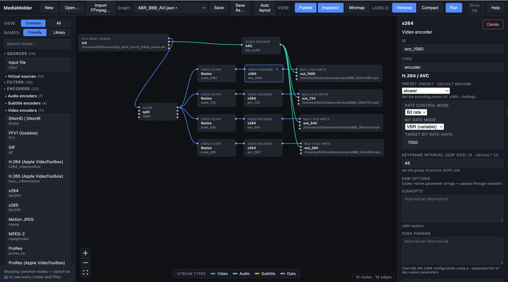
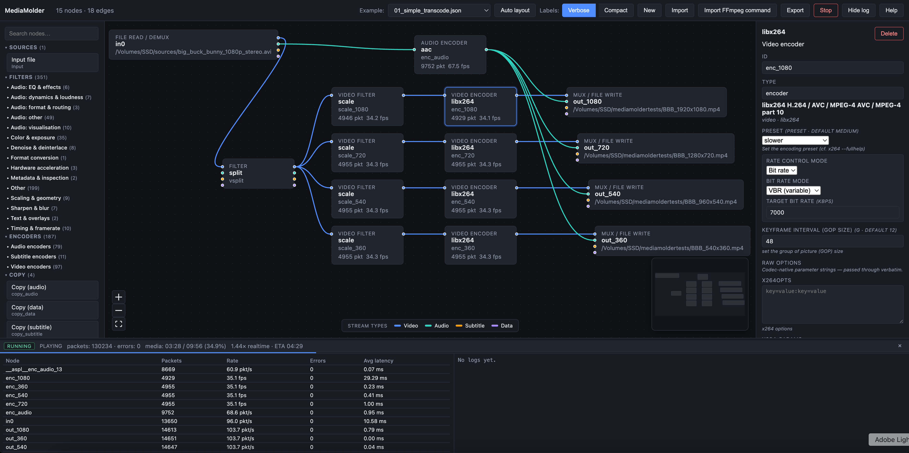

# MediaMolder GUI

The `mediamolder gui` subcommand serves a browser-based visual editor for
building, validating, and running MediaMolder JSON pipelines. It is bundled
into the same single binary as the CLI — no separate install or web server is
required.


## Quick start

```sh
# Build the binary with the embedded production frontend.
make build-gui

# Launch the editor (opens http://127.0.0.1:8080 by default).
./mediamolder gui
```

Useful flags:

| Flag | Default | Description |
|------|---------|-------------|
| `--host`     | `127.0.0.1` | Interface to bind. Use `0.0.0.0` to expose on the LAN. |
| `--port`     | `8080`      | TCP port. |
| `--no-open`  | `false`     | Do not auto-open a browser tab. |
| `--examples` | `testdata/examples` | Directory whose `*.json` files are listed in the **Graph:** dropdown. Set to `""` to disable. |
| `--dev`      | `false`     | Skip the embedded frontend; expects you to run `npm run dev` separately. |

## Your first pipeline (5-minute walkthrough)

For an explanation of nodes, pads, edges, sources and sinks — and the rules
that govern when two nodes can be wired directly versus when a transform
filter has to sit between them — see [Graph Basics](graph-basics.md).

If you have never used the editor before, the canvas opens with an
**onboarding card** that summarises the steps below. Click the
**Help** toolbar button (or press <kbd>?</kbd>) at any time to open the
in-app help dialog.

1. **Pick a starting point.**
   * The fastest path is the **Graph:** dropdown in the toolbar — choose
     any entry to load a built-in example you can edit.
   * Click **New** to start from a blank canvas, or **Open…** to load an
     existing job JSON from disk.
2. **Add a Source.** From the **Sources** category in the left palette, drag
   *Input file* onto the canvas. Click the new node (or its pencil glyph),
   then in the Inspector on the right click **Browse…** next to **URL** to
   pick a media file from your local filesystem.

   The **Sources › Virtual sources** subcategory carries drag-and-drop
   nodes for libavfilter source filters that synthesise frames without
   opening a file: `color`, `testsrc` / `testsrc2`, `smptebars` /
   `smptehdbars`, `mandelbrot`, `life`, `yuvtestsrc` / `rgbtestsrc`,
   `sine`, `anullsrc`, `aevalsrc`, plus `movie` / `amovie` (which open a
   second asset file from inside libavfilter — handy for logo overlays).
   Newly-spawned virtual sources default to `duration=5` seconds so the
   job actually terminates; edit the field in the Inspector to bound by
   `nb_frames` instead, or remove the cap for `anullsrc` / `aevalsrc`
   which are always lazy. The **Lavfi virtual input** entry materialises
   as a top-level `Input` with `kind="lavfi"` so the URL field carries a
   full filtergraph spec (e.g. `anullsrc=r=48000:cl=stereo`) instead of
   a file path.

   The mirror **Sinks › Virtual sinks** subcategory ships `nullsink` and
   `anullsink` for terminating analyser branches (e.g. `ebur128` →
   `ametadata=mode=print` → `anullsink`) without a real muxer output.
3. **Add processing nodes.** From the palette categories:
   * **Filters** — libavfilter operations (scaling, colour, denoise, audio
     dynamics, …) grouped by intent. Hover any entry for a tooltip with the
     full description; type in the search box to narrow the list.
   * **Encoders** — codec implementations grouped by stream type (Video /
     Audio / Subtitle).
   * **Copy** — stream-copy nodes (one per media type) that forward demuxer
     packets straight to the muxer with no decode / encode. Use these for
     lossless remux or "merge tracks from two files" jobs. The destination
     container must accept the source codec.
   * **Processors** — Go-side custom blocks (frame extraction, scene
     detection, transcript writers, …).
4. **Add a Sink.** Drag *Output file* from **Sinks**, click **Browse…** and
   pick **Save** mode in the dialog to choose a destination path and
   filename. Set the **Format** field (e.g. `mp4`) and the encoder names if
   you have not already added explicit encoder nodes.
5. **Connect the nodes.** Each node exposes one handle per stream type on
   each side. Drag from a source handle to a target handle of the **same
   colour**. Mismatched stream types are rejected.
6. **Run.** Click **Run** in the toolbar. The Run panel opens; node badges
   show live `Frames` / `FPS`, and a node that errors is outlined in red.
   Click **Stop** to cancel.
7. **Save / Open.** **Save** writes the current graph back to its on-disk
   file (silent overwrite when the browser supports the File System Access
   API). **Save As…** prompts for a new path. **Open…** loads any job JSON
   from disk (including files written by the CLI). The **Graph:** slot in
   the toolbar shows the current document state — `(empty)`, the example
   name, the filename, or `<not saved>` — with a `•` marker when there
   are unsaved edits. **Import FFmpeg…** opens a dialog where you can
   paste a full `ffmpeg ...` command line; MediaMolder parses it (via
   the same `compat/ffcli` package the `mediamolder convert-cmd` CLI
   uses) and replaces the current canvas with the resulting graph.
   Encoder options like `-crf`, `-preset`, `-tune`, `-profile:v`,
   `-level`, `-g`, `-bf`, `-maxrate`, `-minrate`, `-bufsize`,
   `-pix_fmt`, `-b:v`, `-b:a`, `-q:a`, `-x264-params` and `-x265-params`
   are attached to the synthesised encoder node so the Inspector shows
   the same rate control / quality settings you'd get from running the
   original command. `-c:v copy` / `-c:a copy` produce a stream-copy
   node instead of an encoder.
   **Show CLI** exports the current graph back to an ffmpeg command line
   (see [§ FFmpeg CLI export](#ffmpeg-cli-export) below).

### Tips

* **Auto layout** rearranges the nodes using a left-to-right Dagre layout
  whenever the graph gets messy.
* The **View:** segmented control toggles the Palette, Inspector, and
  Minimap on or off independently. Each choice persists in `localStorage`
  (`mm.view.palette`, `mm.view.inspector`, `mm.view.minimap`).
* The **Labels:** segmented control switches node labels between
  *Verbose* (heading + sublabel) and *Compact* (heading only) so dense
  graphs stay readable.
* Every non-implicit node has a small pencil (✎) button in its header
  (visible on hover or when selected). Clicking it selects that node and
  force-opens the Inspector even if you had it hidden.
* The node and edge tally lives in a small overlay at the **bottom-right
  of the canvas** rather than in the toolbar.
* `Backspace` / `Delete` removes the selected node or connection. The
  shortcut is ignored
  while you are typing in a form.
* Press <kbd>?</kbd> (or click the **Help** button) for the in-app help,
  <kbd>Esc</kbd> to dismiss any open dialog.
* The bottom-centre **Stream types** legend shows the colour code used for
  edges and handles. The bottom-right minimap stays clear of it.
* Edges are unlabelled by default. Hover (or click) any edge to open a
  popover listing every technical property MediaMolder can infer for that
  stream — width×height, pix_fmt, frame_rate, color_space, color_range,
  bit_depth, codec profile/level, bit_rate, sample_rate, channel_layout,
  sample_fmt, etc. Click to pin the popover open. Attributes that no
  upstream node has set are intentionally omitted — MediaMolder never
  guesses. See [Edge attributes](#edge-attributes) below.

## File browser

The Browse… buttons next to **Input → URL** and **Output → URL** open a
modal file picker. It does *not* upload files anywhere — it just helps you
type a correct local path. (The toolbar's **Open…** / **Save** / **Save
As…** buttons use the browser-native File System Access API where
available, falling back to a `<input type=file>` / anchor download in
Firefox and Safari.)

* The left sidebar lists shortcuts for your home directory, the directory
  the binary was launched from, and the filesystem root.
* The pathbar at the top lets you type a path directly and press
  <kbd>Enter</kbd> or click **Go**, or use the **↑** button to ascend.
* In **Open** mode, double-click a file to select it. The dialog filters by
  common media extensions; toggle this off by clearing the URL field
  before browsing.
* In **Save** mode, navigate to the destination directory, edit the
  **Filename** field at the bottom, and click **Save**. The dialog does
  *not* create the file — that happens when the pipeline runs.
* Hidden files (starting with `.`) are not shown.

## Filter categories

Rather than a flat alphabetical list of ~360 filters, the palette organises
filters by intent:

| Bucket | Examples |
|--------|----------|
| Scaling & geometry | `scale`, `crop`, `pad`, `rotate`, `transpose` |
| Color & exposure | `eq`, `curves`, `colorbalance`, `lut3d` |
| Denoise & deinterlace | `hqdn3d`, `nlmeans`, `yadif`, `bwdif` |
| Sharpen & blur | `unsharp`, `gblur`, `boxblur` |
| Text & overlays | `drawtext`, `drawbox`, `overlay` |
| Timing & framerate | `fps`, `setpts`, `framerate`, `tinterlace` |
| Format conversion | `format`, `setdar`, `setsar`, `pixfmt`-related |
| Metadata & inspection | `metadata`, `signalstats`, `cropdetect` |
| Hardware acceleration | `*_qsv`, `*_cuda`, `*_vaapi`, `*_videotoolbox` |
| **Routing** | `split`, `asplit`, `overlay`, `hstack`, `vstack`, `xstack`, `amerge`, `amix`, `concat` |
| Subtitles | `subtitles`, `ass` |
| Audio: format & routing | `aresample`, `aformat`, `pan`, `amerge` |
| Audio: dynamics & loudness | `loudnorm`, `acompressor`, `alimiter` |
| Audio: EQ & effects | `equalizer`, `bass`, `treble`, `aecho` |
| Audio: visualisation | `showwaves`, `showspectrum` |
| Other | anything that does not match the heuristics above |

Each entry shows a friendly label first (e.g. *Scale — set the input video
size*) with the canonical libavfilter name underneath. Hover for the full
description. Use the search box to narrow across all categories — matches
expand the relevant subcategories automatically.

## Anatomy

```
┌──────────────────────────────────────────────────────────────┐
│ Toolbar  [New] [Open…] [Import FFmpeg…] [Graph: ▾]           │
│          [Save] [Save As…] … [Auto layout]                   │
│          [View: Palette·Inspector·Minimap]                   │
│          [Labels: Verbose·Compact]                           │
│          [Run] / [Stop] [Show log] [Help]                    │
├────────────┬─────────────────────────────────────┬───────────┤
│            │                                     │           │
│  Palette   │            Canvas                   │ Inspector │
│  (search   │   (React Flow with stream-typed     │  (form    │
│   filters, │    handles + edges)                 │   for the │
│   codecs,  │                                     │  selected │
│   processors)                                    │   node)   │
│            │                       [n nodes · m] │           │
└────────────┴─────────────────────────────────────┴───────────┘
                                       ┌──────────────┐
                                       │  Run panel   │
                                       │  (status,    │
                                       │   per-node   │
                                       │   metrics,   │
                                       │   error log) │
                                       └──────────────┘
```

The **Palette** and **Inspector** columns can each be hidden via the
toolbar's **View:** segmented control — the canvas expands to fill the
freed space. The node/edge tally is rendered as a small overlay in the
bottom-right of the canvas itself (not in the toolbar).

### Palette

Populated at runtime from `GET /api/nodes`, which lists every libavfilter,
libavcodec encoder, demuxer/muxer, and registered Go processor available in
the binary you are running. Drag any entry onto the canvas to spawn a
configured node.

#### Hardware button

At the very top of the palette — above the search box and segmented controls —
is the **Hardware** button.  It shows the result of the startup hardware probe:

| State | Label |
|-------|-------|
| Probe in progress | `Hardware …` |
| ≥ 1 usable backend | `Hardware  N available` (with a coloured badge) |
| No usable backends | `Hardware  Software only` |

Clicking the button opens the **Hardware Capabilities dialog** — see
[§ Hardware Capabilities dialog](#hardware-capabilities-dialog) below.

Two segmented controls sit above the search box and tailor the palette to
your audience:

* **View — Common · All.** *Common* (the default) shows only a curated
  shortlist of the encoders, filters, and processors most users reach for
  (≈80 entries spanning the popular software + hardware video encoders,
  the AAC / Opus / MP3 / FLAC / PCM audio encoders, the everyday geometry
  / colour / text / audio filters, and every virtual source). *All* shows
  every entry the binary knows about (~360 filters, ~150 encoders, every
  registered processor) — useful for power users searching for an
  exotic codec or filter. Free-text search always queries the full set
  regardless of the toggle, so you never get stuck behind it. Each
  subcategory in Common view also exposes a `Show all in this section…`
  link that locally promotes one section to the full list without
  affecting the others. The choice is persisted in `localStorage`
  (`mm.palette.scope`).
* **Names — Friendly · Library.** *Friendly* (the default) shows the
  curated display label (`x264` instead of `libx264`, `Resize` instead of
  `scale`, `Loudness normalise (EBU R128)` instead of `loudnorm`) on
  every palette item, every graph node heading, and every Inspector
  title. The canonical libavcodec / libavfilter name appears on the
  muted second line so you can always identify what the runtime will
  actually call. *Library* shows the canonical name everywhere — the
  classic FFmpeg-native UI. The Inspector additionally renders the
  canonical name in monospace beneath the heading whenever it differs
  from the friendly label. The choice is persisted in `localStorage`
  (`mm.palette.naming`) and dispatched as a `mm.palette.naming.changed`
  custom event so every visible component re-renders in place.

Search now matches the friendly label and any curated *aliases* in
addition to the canonical name and description. For example, typing
`h264` in either view jumps straight to `libx264`; typing `loudness`
finds `loudnorm`; typing `webm` surfaces both `libvpx-vp9` and `libopus`.

The curation table lives in
[internal/gui/curation.go](../internal/gui/curation.go) and is locked
against FFmpeg drift by `internal/gui/curation_test.go`
(`TestCuratedNodesResolveToRealEntries`).

### Canvas

* Each node exposes one source and one target handle per stream type
  (video / audio / subtitle / data). Handles only accept connections of the
  same type — incompatible drags are rejected.
* Every non-implicit node has a small pencil (✎) button in its header
  that selects the node and force-opens the Inspector — useful when the
  Inspector panel has been hidden via the **View:** toggle. The button
  fades in on hover or when the node is already selected.
* Edges are colour-coded by stream type.
* Hover or click any edge to open a popover with every technical property
  the editor can infer for the stream (see [Edge attributes](#edge-attributes)).
  The popover also has a **Delete** button. Clicking the edge selects it
  (drawn thicker with a glow); the endpoint of an existing connection can
  then be dragged to a different handle to re-route, or dropped on empty
  canvas to discard.
* Node positions are persisted into the saved JSON under `graph.ui.positions`
  (schema v1.2) so reopening a job preserves the layout. The runtime ignores
  this block — it is metadata for the editor only.
* `Backspace` / `Delete` removes the selected node or selected connection
  (input fields are not
  hijacked).

### Edge attributes

Edges carry no inline label. Hover an edge — or click to pin it — to
open a popover at the midpoint listing every known technical property
of the stream travelling along it. Typical content for a probed input:

```
Video:
  size            1920×1080
  pix_fmt         yuv420p
  frame_rate      29.97 fps
  bit_depth       8 bit
  color_space     bt709
  color_range     tv
  color_primaries bt709
  color_transfer  bt709
  codec           h264
  profile         High@L4.0
  bit_rate        8.50 Mbps

Audio:
  sample_rate     48000 Hz
  channels        2 (stereo)
  sample_fmt      fltp
  bit_depth       32 bit
  codec           aac
  profile         LC
  bit_rate        192 kbps
```

The values are inferred at edit time from upstream node parameters by
walking the graph backwards from the edge:

1. Look at the immediate source node. If its `params` set a known
   attribute (`pix_fmt`, `width`, `height`, `frame_rate`, `sample_rate`,
   `channel_layout`, `sample_fmt`, `bit_rate`, …) record it.
2. Apply filter-specific shortcuts: `scale` / `scale_*` contribute
   `width` and `height`; `format` contributes `pix_fmt`; `fps` /
   `framerate` contribute `frame_rate`; `aresample` / `asetrate` /
   `aformat` contribute `sample_rate` / `sample_fmt` / `channel_layout`;
   `encoder` nodes contribute `codec` and `bit_rate`; `Output` nodes
   contribute their `codec_video` / `codec_audio` / `codec_subtitle`.
3. For any attribute not yet known, repeat the lookup on the source's
   own incoming edges (same stream type). The closest node that
   establishes a value wins, so transparent passthroughs like
   `setpts` or `drawtext` correctly propagate the upstream value.
4. Attributes that no node has set are omitted — the popover never
   guesses. An edge with no upstream constraints renders the path
   only and shows nothing on hover.

The popover labels each value with the node that established it
(`pix_fmt: yuv420p · format0`).

The inference code lives in
[`frontend/src/lib/streamAttrs.ts`](../frontend/src/lib/streamAttrs.ts);
add a new entry to `attrsFromGraphNode` to teach the editor about a new
filter or processor that constrains a property.

#### Seeding from the source file ("Get properties")

When the inputs to a graph are unknown, downstream attribute inference can
only show what the JSON explicitly declares — usually nothing for a
freshly-dropped Input node. To bootstrap the chain, click an Input node
and press **Get properties** in the Inspector. The editor calls
`POST /api/probe` with the input URL; the backend opens the file with
`avformat_open_input` + `avformat_find_stream_info` and returns one entry
per stream with all available technical metadata: codec (and FourCC tag),
profile/level, bit_rate, bit_depth, width/height, pix_fmt, frame_rate
(and r_frame_rate), sample aspect ratio, field order, color_space,
color_range, color_primaries, color_transfer, sample_rate, sample_fmt,
channels, channel_layout, duration, and start time. The probed values
are attached to the Input node (editor-only — never written back into the
JSON) and become the seed for the upstream walk, so every connection
downstream of that input gets accurate edge popovers automatically.
Image files (jpg/png/...) are reported as a single video stream with the
image's geometry and pixel format.

The probed metadata is invalidated when the URL changes; click
**Get properties** again after editing the path.

### Hardware Capabilities dialog

Opened by the **Hardware** button at the top of the palette.  The dialog
reflects the hardware probe run at startup (`GET /api/hwaccel`).

#### Backend cards

Each successfully opened backend has a card that shows:

- **Device name** — human-readable GPU or accelerator label (e.g.
  `NVIDIA GeForce RTX 4090`, `Apple VideoToolbox`).
- **Backend label** — canonical type string (NVIDIA CUDA, Apple VideoToolbox,
  Intel QSV, AMD/Intel VAAPI, …).
- **Codec chip rows** — `Video encode`, `Video decode`, `Audio encode`, and
  `Audio decode` rows with a chip for every codec the backend reports.
  The `V`/`A` prefix on the row label appears only when a backend has both
  video and audio codecs. Amber chips with a `⚠` icon indicate codecs the
  backend lists but whose hardware support could not be confirmed.
- **Advanced** — expandable section with supported software pixel formats and
  (when the backend imposes a limit) the maximum encode resolution.

#### Unavailable backends

Any backend the probe tried but could not open appears below the cards in an
**Unavailable backends** list with the error message.

#### Device-picker visibility

The **Hardware device** picker in the Inspector is shown only for:
- Hardware-accelerated filters (those that carry `AVFILTER_FLAG_HWDEVICE` in
  libavfilter — i.e. `scale_cuda`, `scale_vaapi`, `libplacebo`, etc.), and
- Hardware encoder nodes (`h264_nvenc`, `hevc_videotoolbox`, etc.).

It is intentionally *not* shown for ordinary software filters (`scale`,
`loudnorm`, …), even when a hardware device is declared in the job config.

### Inspector

The right-hand panel shows a typed form for the selected node. Codec, filter,
and processor parameters surface as editable fields; arbitrary key/value pairs
can be added for less common options.

#### Hardware device picker (filter and encoder nodes)

Every **filter** and **encoder** node has a **Hardware device** dropdown at the
top of its Inspector form. The dropdown lists every `hardware_devices` entry
declared in the job config (e.g. `gpu0 [cuda]`, `igpu [qsv]`). Select an
entry to set `NodeDef.device` on the node; select `(none — software)` to clear
it and keep the node on the CPU path.

For filter nodes, an **Auto-map to hardware filter** checkbox appears beneath
the picker (only enabled when a device is selected). Checking it sets
`auto_map_hw: true`, which:
- promotes the software filter name to its hardware equivalent
  (e.g. `scale` → `scale_cuda` on a CUDA device), and
- auto-inserts `hwupload`/`hwdownload` nodes at device boundaries.

If the job config has no `hardware_devices` entries the picker shows only
`(none — software)` with a hint to add devices.

#### Canvas HW indicator badges

Two visual badges appear on canvas nodes to reflect hardware state:

- **Purple `⊞ <device>` chip** — shown on any filter or encoder with
  `NodeDef.device` set. Hovering reveals `Hardware device: <name>`.
- **Yellow `⚠ sw/hw` chip** — shown on a software filter (no `device`)
  that is adjacent to at least one hardware-accelerated node in the graph.
  This warns that the runtime must implicitly insert an
  `hwdownload`/`hwupload` round-trip at that boundary, which costs memory
  bandwidth and can reduce the benefit of hardware acceleration. To
  eliminate the warning either assign the same device to the filter and
  enable `auto_map_hw`, or reorder the graph so software filters are
  grouped away from the HW chain.

#### Encoder nodes

Selecting an **encoder** node loads its option schema from
`GET /api/encoders/{name}/options` and renders typed controls for the most
common roles:

* **Preset** — `preset` (or the encoder's equivalent, e.g. `cpu-used` for
  libaom-av1, `deadline` for libvpx-vp9).
* **Rate control** — `rc` when the encoder exposes one. The form watches
  this value to decide whether to surface CRF/CQ/Q (for quality-based
  modes) or the bit-rate field (for VBR/CBR modes) as the secondary
  primary control.
* **Quality** or **Bit rate** — `crf`/`cq`/`q` *or* `b`, depending on the
  selected rate-control mode.
* **Keyframe interval** — `g`.

Each control is sourced from the codec's own AVOption metadata: numeric
fields enforce libav's min/max, enum-like options (e.g. `preset`) become
dropdowns built from `AV_OPT_TYPE_CONST` children sharing the option's
`unit`, and the option's default value is shown as the placeholder.
Leaving a field blank simply omits it from the pipeline JSON, so libav's
own default applies.

The complete option list lives below in two further sections:

* **Raw options** — codec-native parameter strings
  (`x264-params`, `x264-opts`, `x265-params`, `svtav1-params`,
  `aom-params`, `vpx-params`) rendered as multi-line text inputs and
  passed through verbatim. Use these to reach options that aren't
  exposed as individual AVOptions, e.g. `x264-params=keyint=120:me=umh`.
* **Advanced** — collapsible section listing every remaining option
  bucketed by a lightweight heuristic (Threading, Quality, Color,
  Motion, Profile / Level, GOP & frames, Other). A search box at the
  top filters across all groups by option name and help text. The
  generic key/value **Params** editor below still accepts arbitrary
  keys for anything libav adds in the future that the form doesn't
  yet recognise.

#### Input and Output nodes — Timing (trim)

Both the **Input** form and the **Output** form expose a **Timing**
section with three fields, mirroring FFmpeg's per-file timing flags:

| Field            | FFmpeg flag | Meaning                                                |
|------------------|-------------|--------------------------------------------------------|
| **Start (-ss)**  | `-ss`       | Skip to this position before processing.               |
| **Duration (-t)**| `-t`        | Process at most this many seconds, then stop.          |
| **End (-to)**    | `-to`       | Stop at this absolute position. (Don't combine with `-t`.) |

All three accept a number of seconds (`30`, `5.5`) or an
`HH:MM:SS[.ms]` timestamp (`00:00:30`, `01:23:45.250`).

The **side you set them on changes their meaning** — exactly like the
FFmpeg command line:

* **Set on the Input** to trim the *source* before any decoding,
  filtering or encoding. The runtime applies this as a faithful Go port
  of FFmpeg's own demuxer trim logic in `fftools/ffmpeg_demux.c`:
  `Start` (`-ss`) becomes an `avformat_seek_file` to that timestamp
  (with the container's reported `start_time` added when the muxer
  reports one); `Duration` (`-t`) and `End` (`-to`) bound the demux
  loop using the same `recording_time` rules ffmpeg.c uses (`-t` and
  `-to` are mutually exclusive — `-t` wins with a warning; `-to` alone
  is converted to `recording_time = to - max(ss, 0)`). Time strings
  are parsed by `av_parse_time` so any value the FFmpeg CLI accepts
  (`30`, `5.5`, `00:01:23.250`, `90s`) Just Works. This is the right
  place to use them when you want every downstream stage — filters,
  encoders, processors — to see only the trimmed window. Example:
  `Start=10`, `Duration=30` on the input means "decode 30 seconds
  starting 10 seconds in".
* **Set on the Output** to trim what the *muxer* writes. The values
  become muxer options (`Output.options`). Use this when you want the
  full source to flow through the graph but only a slice of the
  encoded result to reach the file. (Note: output-side trimming is
  currently a frontend / schema-level field; the runtime honours the
  input-side flags today, and muxer-side enforcement is tracked
  separately.)

Leave a field blank to omit it. The values round-trip through the
**Import FFmpeg command…** dialog, so an existing
`ffmpeg -ss 5 -t 30 -i in.mp4 -c copy out.mp4` lands in the editor with
Start=5, Duration=30 already populated on the input node.

#### Output nodes — Multi-output tabs and per-stream overrides

When the graph contains more than one **Output** node, the Inspector
renders a **tab strip** at the top of the Output form listing every
output. Click a tab to flip the Inspector and the canvas selection to
that output without going back to the canvas. Single-output graphs are
visually unchanged.

Below the Timing section every Output form exposes a **Streams**
sub-tab strip backed by `Output.streams[]`. Use this to author the
per-stream overrides that on the FFmpeg CLI look like
`-metadata:s:v:0 …`, `-disposition:s:a:1 …`, `-c:v:1 libx264`, or
`-b:v:1 5M`. Click **+ add** to create a new entry, then fill in:

* **Type** — `v` (video), `a` (audio), `s` (subtitle), or `d` (data).
* **Index** — 0-based stream index within the chosen media type.
* **Disposition** — `+`-separated `AV_DISPOSITION_*` flags (e.g.
  `default+forced`, `hearing_impaired`, `commentary`).
* **Metadata** — key/value rows (e.g. `language=eng`, `title=Director's commentary`).
* **Encoder override** — per-stream codec (e.g. `libx264`) plus a
  key/value option editor (e.g. `b=5M`, `crf=18`). Empty leaves the
  output-level codec / option in place.

The Streams editor is the GUI surface for the backend per-stream
metadata + disposition (Wave 1 #3) and per-stream encoder overrides
(Wave 6 #30). It's commonly used together with ABR ladders (one Output
with several video streams, each carrying a different bit-rate
override) and multi-language muxes (one Output with one English
audio + one Spanish audio, each carrying `language=…` metadata and a
`default` / `forced` disposition).

#### Output nodes — Bitstream-filter chains

Below the Streams section every Output form exposes three **Bitstream
filters** sections (video / audio / subtitle) backed by
`Output.bsf_video` / `bsf_audio` / `bsf_subtitle`. Each section
renders one card per chain entry with:

* **Filter** — name input with per-kind autocomplete (`h264_mp4toannexb`,
  `hevc_mp4toannexb`, `aac_adtstoasc`, `h264_metadata`, `dump_extra`,
  `extract_extradata`, `setts`, …).
* **↑ / ↓** — reorder the entry within the chain. Order matters:
  packets flow through the filters left-to-right.
* **×** — remove the entry.
* **Params** — key/value rows mapped to the filter's AVOptions
  (e.g. `video_full_range_flag=1`, `level=4`).

The serialised chain (e.g. `h264_mp4toannexb,h264_metadata=video_full_range_flag=1`)
is shown live in monospace beside the **+ add** button, in the exact
form passed to libavcodec's `av_bsf_list_parse_str`. Empty chains are
elided from the saved JSON.

The most common need is the MPEG-TS handoff:
`h264_mp4toannexb` (or `hevc_mp4toannexb`) on the video chain when
re-muxing an MP4 to TS — without it the muxer chokes on the AVCC-style
NAL units. `aac_adtstoasc` is the dual: required when re-muxing TS to MP4.

#### Output nodes — Container metadata and chapters

Below the Bitstream-filter sections every Output form exposes a
**Container metadata** key/value editor and a **Chapters** table.

* **Container metadata** — backs `Output.metadata` and renders as
  `key=value` rows. Mirrors FFmpeg `-metadata key=value`. Common
  global tags include `title`, `artist`, `album`, `comment`, `genre`,
  `date`, `encoded_by`, `language` (per-stream `language` lives on
  the per-stream metadata editor instead). Container-specific tag
  rewriting (matroska's `TITLE` / MP4's `©nam` / …) is handled by
  libavformat's per-container metadata-conv tables, so the canonical
  short keys here are correct regardless of the muxer.
* **Chapters** — backs `Output.chapters` (matroska / mp4 / ogg /
  ffmetadata containers). Each row carries:
  * **Start (s)** / **End (s)** — chapter bounds in seconds. Free-text
    decimal input parsed on blur; invalid input reverts to the prior
    value.
  * **Title** — chapter title (becomes the `TITLE` tag at mux time).
  * **↑ / ↓** — reorder the chapter in the list.
  * **×** — remove the chapter.
  * **▸ Metadata** — collapsible per-chapter key/value editor for
    additional chapter-scoped tags.

  The **+ add** button pre-fills the new row's `Start` from the
  previous row's `End`, matching the common authoring pattern of
  contiguous chapters. Chapter tables defined here replace anything
  mapped from inputs via `Input.map_chapters`.

Per-stream metadata (e.g. `language=eng` on a specific audio track)
remains on the per-stream tab inside the **Streams** section.

#### Output nodes — HLS / DASH / Tee wizards

When an output's **kind** or **format** requires structured delivery
options, the Inspector surfaces a dedicated wizard form below the
standard URL / codec / tag / timing fields.

##### Output kind selector

A **Kind** select at the top of every Output form switches between:

* `(default)` — plain file output; URL, format, codec, and all other
  standard fields are shown.
* `file` — same as default, explicit.
* `tee` — hides the URL/format/codec/BSF fields and shows the **Tee
  wizard** instead. The output becomes a single-pass multi-format fan-out
  backed by `Output.kind = "tee"` and `Output.targets[]`.

##### HLS wizard (`output.format = "hls"`)

Shown automatically when the output format is `hls`. Fields:

| Field | Backing key | Notes |
|---|---|---|
| **Segment duration (s)** | `hls_time` | Float, seconds |
| **Init segment duration (s)** | `hls_init_time` | Float |
| **Playlist size** | `hls_list_size` | 0 = unlimited (VOD) |
| **Start number** | `hls_start_number` | Integer |
| **Playlist type** | `playlist_type` | `''` / `event` / `vod` |
| **Segment type** | `segment_type` | `''` / `mpegts` / `fmp4` |
| **Segment filename** | `segment_filename` | e.g. `seg_%03d.ts` |
| **fMP4 init filename** | `fmp4_init_filename` | Shown only when `segment_type = fmp4` |
| **Master playlist name** | `master_pl_name` | For multi-variant ABR |
| **Variant stream map** | `var_stream_map` | Structured ABR builder (see below) |
| **HLS flags** | `hls_flags` | Multi-checkbox (see below) |

**Variant stream map builder** — Each row specifies one rendition
group. Columns are: stream types (`v:`, `a:`, `s:`) with their
0-based stream-group index, and an optional `agroup:` / `sgroup:`
association name. The builder serialises the table to the
space-separated `a:0,v:0 a:1,v:1` token format that `hlsenc` expects
for `var_stream_map`.

**HLS flags checkboxes** — `delete_segments`, `append_list`,
`round_durations`, `discont_start`, `split_by_time`,
`program_date_time`, `second_level_segment_index`,
`second_level_segment_duration`, `second_level_segment_size`,
`temp_file`, `independent_segments`, `iframes_only`, `single_file`.

##### DASH wizard (`output.format = "dash"`)

Shown automatically when the output format is `dash`. Fields:

| Field | Backing key | Notes |
|---|---|---|
| **Segment duration (s)** | `seg_duration` | Float |
| **Fragment duration (s)** | `frag_duration` | Float; `0` = one fragment per segment |
| **Window size** | `window_size` | Segments in live manifest; `0` = unlimited |
| **Extra window size** | `extra_window_size` | Keep N extra segments for clients |
| **Init segment name** | `init_seg_name` | Filename template |
| **Media segment name** | `media_seg_name` | Filename template |
| **Adaptation sets** | `adaptation_sets` | `id=0,streams=v id=1,streams=a` |
| **Use SegmentTemplate** | `use_template` | Tri-state: unset / true / false |
| **Use SegmentTimeline** | `use_timeline` | Tri-state: unset / true / false |
| **Streaming mode** | `streaming` | Bool; enable chunked HTTP output |
| **Low-latency DASH (LDASH)** | `ldash` | Bool |
| **HLS playlist (CMAF)** | `hls_playlist` | Bool; emit HLS alongside DASH |
| **Single file** | `single_file` | Bool |
| **DASH flags** | `dash_flags` | Multi-checkbox (see below) |

The **tri-state toggles** for `use_template` and `use_timeline` let
you leave the value as "unset" (libavformat default), force it on, or
force it off — matching the three-way semantics that LL-DASH workflows
require.

**DASH flags checkboxes** — `default_base_url_override`,
`round_durations`, `single_file_name`, `global_sidx`, `write_prft`,
`allow_media_loss`.

##### Tee wizard (`output.kind = "tee"`)

Shown when the Output kind is `tee`. Renders one collapsible row per
`TeeTarget` entry in `output.targets[]`. The first row is open by
default; subsequent rows are collapsed with a `▸ Target N — <url>`
header.

Per-target fields:

| Field | Backing key | Notes |
|---|---|---|
| **URL** * | `url` | Required; red asterisk + outline when empty |
| **Format** | `format` | e.g. `mp4`, `hls`; empty = auto-detect |
| **Select** | `select` | Stream-type selector: `v` / `a` / `s` |
| **BSFs** | `bsfs` | Bitstream-filter chain (same syntax as output BSF) |
| **On fail** | `onfail` | `''` / `abort` / `ignore` |
| **Use FIFO** | `use_fifo` | Tri-state: default / true / false |
| **FIFO options** | `fifo_options` | Shown only when `use_fifo = true` |
| **Extra options** | `options` | Key/value editor for target-level AVOptions |

Click **+ add target** to append a new (empty, collapsed) row.
The `×` button on each row removes it. Reorder by drag is not
currently supported; remove and re-add to change order.

### Filter nodes — expression editor

For AVOptions whose value is parsed by libavutil's expression evaluator
(e.g. `drawtext.x`, `crop.w`, `overlay.enable`, `setpts.expr`,
`select.expr`) the Inspector renders a syntax-highlighted, live-validating
`ExpressionInput` control instead of a plain text field.

#### Syntax highlighting

The expression textarea overlays a transparent `<pre>` with coloured
tokens:

| Colour | Token class |
|---|---|
| Purple | libavutil built-in functions (`between`, `if`, `mod`, `min`, …) |
| Teal | Filter-specific variable names (`t`, `n`, `tw`, `main_w`, …) |
| Green | Numeric literals |
| Dim grey | Operators and punctuation |
| Red wavy underline | Unknown identifiers (not in the variable or function set) |

#### Live eval preview

The expression is evaluated via `GET /api/filters/{filter}/eval-expression`
with a 250 ms debounce. The result appears inline as:

* `= X (from context)` — when upstream pad hints are available (see below)
* `= X (vars=0)` — all variables default to 0 (libavfilter "before-frame"
  semantics)
* Red error message — when libavutil rejects the expression

#### Variable autocomplete

While typing an identifier, a floating completion list appears beneath
the text area listing all matching variable names and function names.
Variables appear teal; functions appear purple, matching the
syntax-highlight colours.

Navigation:
- `↓` / `↑` — move highlight
- `Tab` or `Enter` — accept the highlighted completion (replaces the
  partial word at cursor)
- `Esc` or continue typing — dismiss

#### Context-aware eval (upstream pad hints)

When the filter node has an upstream input node whose file has been
probed (via the **Get properties** button on the Input form), the
Inspector extracts the first video stream's `{width, height, frame_rate,
sar}` and the first audio stream's `{sample_rate, channels}` and injects
them as variable bindings in the eval request. Variable names populated
this way include `w`, `h`, `iw`, `ih`, `in_w`, `in_h`, `main_w`,
`main_h`, `W`, `H`, `r`, `FR`, `sar`, `sr`, `nb_channels`. The preview
then shows realistic values — for example `(main_w-tw)/2` evaluates to
`880` for a 1920 px wide source rather than `0`.

#### Pattern cookbook

The **Insert pattern…** dropdown below the textarea contains 19
ready-to-use expression snippets:

| Pattern | Expression | Typical use |
|---|---|---|
| Timeline gate | `between(t,1,8)` | `enable=` on any filter |
| Enable after timestamp | `gt(t,30)` | `enable=` |
| Disable in range | `not(between(t,2,5))` | `enable=` |
| 2× speed | `0.5*PTS` | `setpts.expr` |
| 0.5× slow-mo | `2*PTS` | `setpts.expr` |
| drawtext center X | `(main_w-tw)/2` | `drawtext.x` |
| drawtext bottom-center Y | `main_h-line_h-10` | `drawtext.y` |
| drawtext top-right X | `main_w-tw-10` | `drawtext.x` |
| drawtext scrolling marquee | `w-mod(40*t,w+tw)` | `drawtext.x` |
| Force key every 2 s | `expr:gte(t,n_forced*2)` | `Output.ForceKeyFrames` |
| overlay center X | `(main_w-overlay_w)/2` | `overlay.x` |
| overlay center Y | `(main_h-overlay_h)/2` | `overlay.y` |
| crop/pad center X | `(in_w-out_w)/2` | `crop.x`, `pad.x` |
| crop/pad center Y | `(in_h-out_h)/2` | `crop.y`, `pad.y` |
| Volume 3 s fade-in | `if(lt(t,3),t/3,1)` | `volume.volume` |
| Volume/alpha fade in+out | `if(lt(t,1),t,if(lt(t,4),1,if(lt(t,5),5-t,0)))` | `volume.volume`, `drawtext.alpha` |
| Select keyframes | `eq(pict_type,PICT_TYPE_I)` | `select.expr` |
| Select every 5th frame | `if(eq(mod(n,5),0),1,0)` | `select.expr` |
| Ken Burns slow zoom | `min(zoom+0.0015,1.5)` | `zoompan.zoom` |

Selecting a pattern inserts it at the current cursor position,
replacing any selected text.

#### Supported filters

The expression control is active for the following filters and their
expression-typed options. The variable set listed is what the completion
dropdown and eval endpoint use.

| Filter | Expression options | Key variables |
|---|---|---|
| `drawtext` | `x`, `y`, `fontsize`, `alpha`, `enable` | `t`, `n`, `tw`, `th`, `main_w`, `main_h`, … |
| `overlay` | `x`, `y`, `enable` | `main_w`, `main_h`, `overlay_w`, `overlay_h`, `t`, `n` |
| `crop` | `x`, `y`, `w`, `h`, `enable` | `in_w`, `in_h`, `out_w`, `out_h`, `t`, `n` |
| `scale` | `w`, `h` | `in_w`, `in_h`, `a`, `sar`, `dar` |
| `pad` | `w`, `h`, `x`, `y`, `enable` | `in_w`, `in_h`, `out_w`, `out_h` |
| `rotate` | `angle`, `out_w`, `out_h`, `enable` | `in_w`, `in_h`, `n`, `t` |
| `zoompan` | `zoom`, `x`, `y`, `d`, `fps`, `enable` | `zoom`, `x`, `y`, `in_w`, `in_h` |
| `setpts` | `expr` | `PTS`, `N`, `T`, `TB`, `STARTPTS`, `FR`, … |
| `asetpts` | `expr` | `PTS`, `N`, `T`, `S`, `SR`, … |
| `volume` | `volume`, `enable` | `n`, `t`, `nb_samples`, `sample_rate` |
| `select` | `expr` | `n`, `pts`, `t`, `key`, `scene`, `pict_type`, `PICT_TYPE_I`, … |
| `aselect` | `expr` | `n`, `pts`, `t`, `nb_samples`, `sample_rate` |
| `hue` | `h`, `s`, `b`, `enable` | `n`, `pts`, `t`, `r`, `tb` |
| `geq` | `lum_expr`, `cb_expr`, `cr_expr`, `r_expr`, `g_expr`, `b_expr`, `a_expr` | `X`, `Y`, `W`, `H`, `N`, `T`, `BYTES`, `lum`, `cb`, `cr` |
| `trim` | `enable` | `t`, `n`, `pos` |
| `atrim` | `enable` | `t`, `n`, `pos`, `s`, `sr` |

All other filters fall back to the universal `{t, n, pos, w, h}` variable
set for the `enable=` timeline expression surface.

### Filter nodes — audio channel-routing matrix

For the six audio channel-routing filters (`pan`, `channelmap`,
`channelsplit`, `join`, `amerge`, `amix`) the generic AVOption form is
replaced by a purpose-built `AudioChannelForm` that presents structured
controls instead of a free-form `params` dict.  All sub-forms include a
**live spec preview** row at the bottom that shows the exact filter
argument string as it will appear in the pipeline.

#### `pan` — gain matrix

Two **Layout** selectors at the top control the column set (input
channels) and the row set (output channels) of the matrix.  Both accept
the name of any standard FFmpeg layout preset (`mono`, `stereo`, `5.1`,
`7.1`, …) with autocomplete, and the channel list is shown as a
monospace hint to the right.

The **gain matrix** renders as a CSS grid: rows are output channels,
columns are input channels.  Each cell accepts a floating-point gain
coefficient (empty or `0` = muted, `1` = full level, `0.5` = −6 dB,
etc.).  Non-zero cells are highlighted with an accent border and
background tint for quick visual reference.  The underlying
`params._pos0` string (the `pan=` positional argument) is updated on
every keystroke.

> **Note.** If `params._pos0` already contains positional channel names
> (`c0`, `c1`, …) from a machine-generated spec, the form translates them
> to named channels using the output-layout as the reference.

#### `channelmap` — per-output source dropdowns

Exposes a **Output layout** selector and a source row for each output
channel.  Each row shows a `←` arrow and a dropdown listing all
well-known FFmpeg channel names.  The serialised form is written to
`params.map` as `IN_CH-OUT_CH` pairs separated by `|`.

#### `channelsplit` — layout selector

Shows a single **Input layout** selector and a notice listing the output
pads that will be produced.  `channelsplit` creates one output pad per
channel in the layout; connect each pad to a separate downstream filter
or encoder.  No mapping parameters are required.

#### `join` — stream + channel pickers

Shows an **Input streams** count, an **Output layout** selector, and a
source row for each output channel.  Each row provides a stream-index
dropdown (`#0`, `#1`, …) and a channel-name dropdown.  The serialised
form is written to `params.map` as `STREAM.IN_CH-OUT_CH` triplets
separated by `|`.

#### `amerge` — input count spinner

Shows a single **Input streams to merge** number input.  A notice
reminds that each input stream must have a distinct channel layout (e.g.
two mono streams → stereo; stereo + stereo → quad).

#### `amix` — weighted mix with options

Shows an **Input streams** spinner, a column of per-input **weight**
fields, and three option controls:

| Field | Default | Description |
|---|---|---|
| **Duration policy** | `longest` | `longest` / `shortest` / `first` — when mixed streams have different lengths |
| **Normalize** | `true` | Rescale so the sum of weights equals 1 |
| **Dropout transition (s)** | `2.0` | Fade-out time applied when an input stream ends early |

### Asset registry

The **Assets** toolbar button opens the Asset Registry — a named table of media files (fonts, ML model weights, LUT files, or any other path) that filter params can reference by symbolic name instead of a hard-coded absolute path.  This keeps pipeline JSON machine-agnostic: fonts, RNNoise models, and LUT cubes live at different absolute paths on each workstation.

#### Using assets in a filter

In any filter node's **params**, set an option value to `$asset:<name>` where `<name>` is the key in the registry:

```
fontfile = $asset:heading
model    = $asset:cb_rnnn
filename = $asset:filmLUT
```

The runtime substitutes the resolved absolute path before constructing the libavfilter graph.  If the name is absent from the registry, the job fails validation.

#### Path resolution

1. If the stored path is absolute and the file exists, it is used as-is.
2. If the path is relative, the runtime searches left-to-right:
   - the current working directory, then
   - each directory listed in the `MEDIAMOLDER_ASSET_PATH` environment variable (colon-separated on POSIX, semicolon-separated on Windows).

Set `MEDIAMOLDER_ASSET_PATH` in the server's environment to point at a shared assets directory (e.g. `/opt/media/assets`).

#### Registry management

| Column | Notes |
|--------|-------|
| **Name** | Symbolic identifier.  Must start with a letter or underscore, then letters, digits, underscores, or hyphens (no spaces). |
| **Kind** | `font` (TTF/OTF for `drawtext=`/`subtitles=`), `model` (ML model file for `arnndn=` / YOLO), `lut` (.cube/.3dl/.m3d for `lut3d=`/`haldclut=`), `other`. |
| **Path** | Absolute or relative path.  Use **Browse…** to pick from the server filesystem via the file browser. |
| **Description** | Optional free-text label (GUI only; no runtime effect). |

Click **Add** to create a new entry, **Edit** to modify an existing one, or **Remove** to delete it.  The toolbar **Assets** button shows a count badge when the registry is non-empty.

#### Schema field

The registry is serialised as the top-level `assets` field in the job JSON:

```json
{
  "schema_version": "1.2",
  "assets": {
    "heading": { "path": "/opt/fonts/OpenSans-Bold.ttf", "kind": "font" },
    "cb_rnnn": { "path": "models/cb.rnnn", "kind": "model", "desc": "RNNoise Canonical Baseline" },
    "filmLUT":  { "path": "luts/film.cube", "kind": "lut" }
  },
  ...
}
```

### Subtitle affordances

Three subtitle-specific controls are surfaced in the Inspector (Wave 8 #52).

#### Input nodes — subtitle charset

The **Subtitle charset** field in the Input inspector maps to the FFmpeg
`-sub_charenc CODE` option.  Leave it empty for the default (UTF-8).
Use the built-in picker to choose a common encoding:

| Value | Use case |
|---|---|
| `UTF-8` | Default for most modern subtitle files |
| `Windows-1250` / `Windows-1251` | Central/Eastern European and Cyrillic SRT files |
| `ISO-8859-1` | Older Western European subtitles |
| `Shift_JIS` / `GB18030` / `Big5` | CJK subtitles |
| `KOI8-R` | Russian legacy encoding |

The option is silently ignored by FFmpeg for bitmap subtitle codecs (PGS,
DVB) because they carry timing and layout information rather than character
data — no `sub_charenc_mode` is applied.

#### Per-stream stream overrides — Forced and HI flags

When editing a `StreamSpec` with **type = s (subtitle)** inside the
**Streams** sub-panel of an Output node, the **Subtitle flags** section
replaces the raw disposition text field with two dedicated checkboxes:

| Checkbox | AV_DISPOSITION_* flag | Effect |
|---|---|---|
| **Forced** | `forced` | Player always renders this track regardless of user preference (e.g. foreign-language inserts) |
| **Hearing impaired (HI)** | `hearing_impaired` | Marks the track as carrying transcriptions of speech and sound effects |

An **Other disposition flags** text field below the checkboxes accepts any
additional `+`-separated `AV_DISPOSITION_*` tokens (e.g. `default`,
`comment`) that are not covered by dedicated controls.

For all non-subtitle stream types (video, audio, data) the existing
free-text **Disposition** field is shown unchanged.

#### Output nodes — Subtitle rendering mode

The **Subtitle rendering** selector in the Output inspector appears above
the subtitle codec row and lets you indicate how subtitles will be
delivered:

| Mode | Description |
|---|---|
| **Soft-mux** (default) | A separate subtitle stream is written to the container alongside the video and audio streams.  The subtitle codec, codec tag, and bitstream-filter chain fields are shown. |
| **Burn-in** | Subtitles are rendered directly into the video pixels via a filter.  The codec/tag/BSF fields are hidden; a guidance banner explains how to add a `subtitles=` or `ass=` filter node to the graph. |

This is a GUI-level advisory control — switching to burn-in mode does not
automatically add a filter node.  Add the appropriate filter manually:

- `subtitles=filename='subs.srt'` — SRT / ASS soft-rendered via libass
- `ass=filename='subs.ass'` — Styled ASS with full override capability

**Codec-container compatibility warning.** In soft-mux mode, if the
selected subtitle codec is known to be incompatible with the output
container format, an amber inline warning is shown directly below the
codec row:

```
⚠ "mov_text" may not be compatible with "mkv" containers. Compatible: mp4, mov, m4a, m4v, ipod.
```

Validated pairs (non-exhaustive):

| Subtitle codec | Compatible containers |
|---|---|
| `mov_text` | `mp4`, `mov` |
| `webvtt` | `webm`, `mkv`, `mp4`, `hls` |
| `ass` / `ssa` | `mkv` |
| `srt` / `subrip` | `mkv` |
| `dvd_subtitle` | `mp4`, `mkv`, `vob` |
| `hdmv_pgs_subtitle` | `mkv` |

Unknown codecs or missing format fields produce no warning (no opinion).

### FFmpeg CLI export

**Show CLI** (toolbar button, enabled when the canvas is non-empty) converts
the current graph back to an equivalent `ffmpeg …` command line. It posts the
serialised `JobConfig` to `POST /api/export-cmd` and displays the result in a
modal panel with a **Copy** button.

The export is handled by `compat/ffcli.Export` — the inverse of the importer —
and covers:

| Feature | Exported |
|---|---|
| Global options (`-y`, `-loglevel`, `-threads`, `-filter_threads`) | ✅ |
| Inputs (`-i`, `-ss`, `-to`, `-t`, `-stream_loop`, `-r`, `-readrate`, `-f`, `-itsoffset`, `-charenc`, `-copyts`) | ✅ |
| Explicit `-map` flags | ✅ |
| Encoders (codec, rate control, quality, `-b:v/a`, `-maxrate`, `-bufsize`, `-crf`, `-qscale`, `-profile:v`, `-preset`, `-tune`, `-level`, `-pix_fmt`, `-g`, `-bf`, `-x264-params`, `-x265-params`) | ✅ |
| Per-stream bitstream filter chains (`-bsf:v/a`) | ✅ |
| Stream dispositions (`-disposition:v/a`) | ✅ |
| Stream metadata (`-metadata:s:v/a`) | ✅ |
| Container metadata (`-metadata`) | ✅ |
| `-t`, `-frames:v`, `-shortest` output limits | ✅ |
| `-an`, `-vn`, `-sn` | ✅ |
| Two-pass (`-pass 1/2`, `-passlogfile`) | ✅ |
| `-fps_mode` | ✅ |
| `-map_chapters` | ✅ |
| HLS (`-hls_time`, `-hls_list_size`, `-hls_flags`, etc.) | ✅ |
| DASH (`-seg_duration`, `-dash_segment_type`, etc.) | ✅ |
| Tee output (`-f tee "…"`) | ✅ |
| Filter graph (`-filter_complex`) | ✅ |
| `Assets` registry | ⚠ not exportable — listed in "no CLI equivalent" |
| `go_processor` nodes | ⚠ not exportable |
| `LoudnormPass` / two-pass loudness | ⚠ not exportable |
| Multi-output stream mapping | ⚠ approximate (no per-output `-map`) |

Features that have no ffmpeg CLI equivalent are listed in an amber warning
section in the dialog. The generated command is a best-effort approximation
and may need manual adjustment for complex graphs.



Click **Run** to execute the current graph. The frontend POSTs the job to
`/api/run`, then opens an `EventSource` against `/api/events/{jobId}` to
receive a stream of typed events:

| Event      | Payload                                                                 |
|------------|-------------------------------------------------------------------------|
| `state`    | `{from, to}` — pipeline state transitions (Ready → Playing → ...).     |
| `metrics`  | `{State, Elapsed, Nodes:[{NodeID, Frames, FPS, Errors, ...}]}` snapshot.|
| `error`    | `{node_id, stage, error}` — per-node failures.                          |
| `log`      | `{message}` — informational entries (e.g. EOS).                         |
| `metadata` | `pipeline.ProcessorMetadata` events from custom processors.             |
| `done`     | `{status: "succeeded"\|"failed"\|"canceled", error}` — terminal event.  |

Live data is merged back into each node on the canvas: frame counts and FPS
appear as badges, and any node that has logged an error is outlined in red.
**Stop** cancels the underlying `context.Context` so the run unwinds cleanly.

## HTTP API

All endpoints are unauthenticated and intended for `localhost` use. Bind
explicitly to `127.0.0.1` (the default) if untrusted users share the host.

| Method | Path                          | Purpose                                               |
|--------|-------------------------------|-------------------------------------------------------|
| `GET`  | `/api/health`                 | Liveness probe.                                       |
| `GET`  | `/api/nodes`                  | Catalogue of available filters/codecs/processors.     |
| `GET`  | `/api/examples`               | List of bundled example job JSONs.                    |
| `GET`  | `/examples/{file}`            | Static serve of the examples directory.               |
| `POST` | `/api/validate`               | Parse + structurally validate a posted JobConfig.     |
| `POST` | `/api/convert-cmd`            | Parse an FFmpeg command line into a JobConfig. Body `{command: string}`; response `{config: JobConfig, unsupported?: string[]}` on success or `422 {error: string}` on parse failure. `unsupported` lists actionable notes for deprecated, out-of-scope, or Wave 5–7 schema-promoted flags. Backed by `compat/ffcli.ParseFull`. Used by the toolbar's **Import FFmpeg…** dialog. |
| `POST` | `/api/export-cmd`             | Export the current JobConfig as an ffmpeg command line. Body `{config: JobConfig}`; response `{command: string, lines: []string, unsupported: []string}` on success or `422 {error: string}`. Backed by `compat/ffcli.Export`. Used by the toolbar's **Show CLI** dialog. |
| `POST` | `/api/run`                    | Start a run; returns `{job_id}`.                      |
| `POST` | `/api/cancel/{jobId}`         | Cancel an in-flight run.                              |
| `GET`  | `/api/events/{jobId}`         | Server-Sent Events stream for the run.                |
| `GET`  | `/api/files`                  | List a directory (`?path=&filter=ext1,ext2&dirs_only=`). |
| `POST` | `/api/probe`                  | Probe an input URL with libavformat. Body `{url, options?}`; response `{url, streams: [{index, type, codec, codec_tag, profile, level, bit_rate, bit_depth, bits_per_coded_sample, bits_per_raw_sample, width, height, pix_fmt, frame_rate, r_frame_rate, sar, field_order, color_space, color_range, color_primaries, color_transfer, sample_rate, sample_fmt, channels, channel_layout, duration_sec, start_sec, time_base_num, time_base_den}]}`. Used by the Inspector's **Get properties** button. |
| `GET`  | `/api/encoders/{name}/options` | Enumerate every AVOption available on the named encoder (both generic AVCodecContext options and the codec's private options). Response: `{name, long_name, media_type, options: [{name, help, type, unit, min, max, default, constants?, is_private}]}`. `type` is one of `int`/`int64`/`uint64`/`bool`/`float`/`double`/`string`/`flags`/`rational`/`pix_fmt`/`sample_fmt`/`channel_layout`/`duration`/`color`/`binary`/`dict`. `constants` is populated for enum-like options (every `AV_OPT_TYPE_CONST` whose `unit` matches). Cached in-memory after the first call. |

### Why SSE rather than WebSockets?

Progress streaming is one-way (server → client), so SSE is sufficient and
considerably simpler:

* `EventSource` is built into every modern browser; no client library needed.
* No additional Go module dependency.
* Auto-reconnect and event framing are handled by the protocol.

The job manager keeps the most recent 64 events per run in memory so a client
that connects mid-run still sees prior `error`/`state` events.

## Development workflow

```sh
# Terminal 1: backend in dev mode (skips the embedded frontend).
make gui-dev

# Terminal 2: Vite dev server with hot reload + /api proxy.
make frontend-dev
```

Open <http://127.0.0.1:5173>. Edits to `frontend/src/**` reload instantly;
edits to Go code require restarting the backend.

To produce a single shippable binary with the production frontend embedded:

```sh
make build-gui
```

## Schema impact

The GUI persists node positions under `graph.ui.positions` keyed by node ID
(schema v1.2). Older `schema_version: "1.0"` and `"1.1"` jobs load and run
unchanged; the editor will add the `ui` block on save. Pipelines authored
without the GUI never need to include it.

## Security considerations

* The GUI server has no authentication. Treat it as a developer tool and bind
  it to a trusted interface.
* `/api/run` accepts any JobConfig the local pipeline package can parse,
  including file paths the binary has access to. Do not expose the port on
  untrusted networks.
* The job manager retains the 16 most recent finished runs (events + metrics)
  in memory; older runs are garbage-collected.

## Troubleshooting

| Symptom | Likely cause / fix |
|---------|--------------------|
| **Blank canvas, palette empty.** | The frontend could not reach `/api/nodes`. Check the terminal where `mediamolder gui` is running for an error and confirm the page URL points at the same host/port. |
| **"Too many redirects" loading the page.** | You are hitting an old build. Rebuild with `make build-gui` (the embedded SPA fallback no longer rewrites `/index.html`). |
| **Browse… dialog shows "permission denied".** | The directory is not readable by the user running `mediamolder`. Either `chmod` it or pick a different location. |
| **Connections rejected when wiring nodes.** | Handles are stream-typed. A video output cannot connect to an audio input — see the bottom-centre legend for the colour code. |
| **`Run` button does nothing.** | The pipeline failed validation. Check the toolbar for a red error banner; common causes are missing URLs, dangling outputs, or unknown filter/codec names. |
| **No live FPS in node badges.** | The pipeline is not in `Playing` state. Confirm the Run panel shows progressing frame counts; otherwise check the `error` events in the panel. |
| **Filter not in the palette.** | The binary was built without that filter (e.g. a stripped FFmpeg). Rebuild FFmpeg with the missing component enabled. |
| **`mediamolder` binary date didn't change after `go build ./...`.** | `go build ./...` is a compile check only. Use `make build-gui` or `go build -o mediamolder ./cmd/mediamolder` to actually overwrite the binary. |
